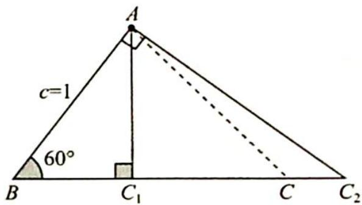

> [!faq]- 《高考数学培优40讲》例题解析
>
> > [!success]- **【答案】** 详见解析
>
> > [!note]- **【分析】**
> > 分析 ▶ (1) 使用正弦定理边化角, 因为有 $\frac{A + C}{2}$ , 所以用三角形内角和为 $180^{\circ}$ 减少角度的个数, $\frac{B}{2}$ 和B同时出现,使用二倍角公式使角度大小统一,利用余弦函数的有界性减少三角函数名的个数,最后可直接求出B的大小.
> >
> > (2)已知角 B 和一个邻边 c，把点 C 看作角 B 的另一邻边上的动点，根据临界情况（角 A 或角 C 为直角）求出另一邻边的取值范围，由 $S=\frac{1}{2}ac\sin B$ 可得面积的取值范围.
>
> > [!note]- **【解析】**
> > 解析 (1) 已知 $a \sin \frac{A + C}{2} = b \sin A$ , 边化角可得 $\sin A \sin \frac{A + C}{2} = \sin B \sin A$ , 即 $\sin \frac{A + C}{2} = \sin B$ , 所以 $\sin \frac{\pi - B}{2} = \cos \frac{B}{2} = \sin B = 2 \sin \frac{B}{2} \cos \frac{B}{2}$ , 即 $\cos \frac{B}{2} (2 \sin \frac{B}{2} - 1) = 0$ , 则 $\sin \frac{B}{2} = \frac{1}{2}$ , 又 $\frac{B}{2} \in (0, \frac{\pi}{2})$ , 所以 $\frac{B}{2} = \frac{\pi}{6}, B = \frac{\pi}{3}$ .
> > (2)如图所示,由题意可得点 $C$ 位于 $C_{1}$ 和 $C_{2}$ 之间的线段上, $S_{\triangle ABC_1} < S_{\triangle ABC} < S_{\triangle ABC_2}$ .
> > 当 $C$ 位于 $C_1$ 时， $BC_1 = 1 \times \cos 60^\circ = \frac{1}{2}, S_{\triangle ABC_1} = \frac{1}{2} \times 1 \times \frac{1}{2} \times$
> > 
> > $\sin 60^{\circ} = \frac{\sqrt{3}}{8}$ ; 当 $C$ 位于 $C_{2}$ 时, $BC_{2} = \frac{1}{\cos 60^{\circ}} = 2$ , $S_{\triangle ABC_{2}} = \frac{1}{2} \times 1 \times 2 \times \sin 60^{\circ} = \frac{\sqrt{3}}{2}$ .
> > 所以 $\frac{\sqrt{3}}{8}<S_{\triangle ABC}<\frac{\sqrt{3}}{2}$ ，即 $\triangle ABC$ 的面积的取值范围为 $(\frac{\sqrt{3}}{8},\frac{\sqrt{3}}{2})$ .
