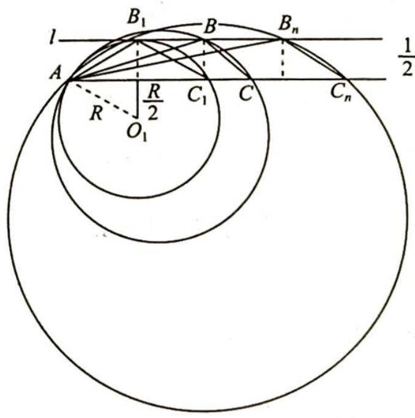

> [!faq]- 《高考数学培优40讲》例题解析
>
> > [!success]- **【答案】** 详见解析
>
> > [!note]- **【分析】**
> > 分析 ▶ 使用正弦定理边化角,用三角形内角和为 $180^{\circ}$ 减少角度的个数,根据正弦函数的有界性减少三角函数名的个数,可直接求出 $B = \frac{2 \pi}{3}$ .
> >
> > 思路一(代数法): 已知 $B=\frac{2\pi}{3}$ ，使用余弦定理和基本不等式可得三角形三边的不等关系 $b^{2}\geqslant3ac$ ，三角形面积公式 $S_{\triangle ABC}=\frac{1}{2}ac\sin B=\frac{1}{2}AC\cdot\frac{1}{2}=\frac{1}{4}b$ ，可得三角形三边的等量关系 $b=\sqrt{3}ac$ ，代入可得 ac 的范围，即可求出 $\triangle ABC$ 面积的范围.
> >
> > 思路二(几何法): 把点 B 看作是与底边的距离为 $\frac{1}{2}$ 的直线上的动点, 使用正弦定理将面积问题转化为圆的半径问题, 结合图形, 使用垂径定理和勾股定理可得半径的取值范围.
>
> > [!note]- **【解析】**
> > 解析 已知 $2a + c = 2b\cos C$ ，使用正弦定理边化角可得 $2\sin A + \sin C = 2\sin B\cos C$ ，所以 $2\sin (B + C) + \sin C = 2\sin B\cos C$ ，即 $2\sin B\cos C + 2\cos B\sin C + \sin C = 2\sin B\cos C, 2\cos B\sin C +$
> > $\sin C = 0, \sin C(2\cos B + 1) = 0.$
> > 因为 $C \in (0, \pi)$ , 所以 $\sin C \neq 0$ , 则 $2 \cos B + 1 = 0, \cos B = -\frac{1}{2}$ .
> > 又 $B \in (0, \pi)$ , 所以 $B = \frac{2\pi}{3}$ .
> > 解法一(代数法): $b^{2}=a^{2}+c^{2}-2ac\cos B=a^{2}+c^{2}+ac\geqslant3ac.$
> > 因为 $S_{\triangle ABC} = \frac{1}{2} ac\sin \frac{2\pi}{3} = \frac{\sqrt{3}}{4} ac, S_{\triangle ABC} = \frac{1}{2} AC \cdot \frac{1}{2} = \frac{1}{4} b$ ，所以 $b = \sqrt{3} ac, 3a^2c^2 \geqslant 3ac$ ，即 $ac \geqslant 1$ ，则 $S_{\triangle ABC} = \frac{\sqrt{3}}{4} ac \geqslant \frac{\sqrt{3}}{4}$ ，故 $\triangle ABC$ 面积的最小值为 $\frac{\sqrt{3}}{4}$ .
> > 解法二(几何法): 因为 $\frac{b}{\sin B}=2R$ , 所以 $b=2R\sin\frac{2\pi}{3}=\sqrt{3}R$ , $S_{\triangle ABC}=\frac{1}{2}AC\cdot\frac{1}{2}=\frac{1}{4}b=\frac{\sqrt{3}}{4}R.$
> > 如图所示, 设与 $AC$ 平行且相距为 $\frac{1}{2}$ 的直线为 $l, B$ 为直线 $l$ 上的点, 且满足 $\angle ABC = \frac{2\pi}{3}$ , 在这一系列圆中满足 $B = \frac{2\pi}{3}$ 且与 $l$ 相切时的 $S_{\triangle ABC}$ 最小, 设此圆为 $\odot O_1$ , 此时 $\triangle AO_1B_1$ 为等边三角形, $\frac{R}{2} = R - \frac{1}{2}$ , 解得 $R = 1$ , 即 $R_{\min} = 1$ .
> > 
> > 所以 $S_{\triangle ABC}=\frac{\sqrt{3}}{4}R\geqslant\frac{\sqrt{3}}{4}$ ，故 $\triangle ABC$ 面积的最小值为 $\frac{\sqrt{3}}{4}$ .
