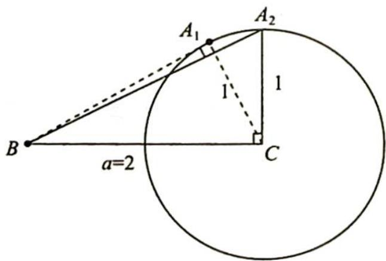

> [!faq]- 《高考数学培优40讲》例题解析
>
> > [!success]- **【答案】** 详见解析
>
> > [!note]- **【分析】**
> > 分析 ▶ 以 C 为圆心, b 为半径作圆 C, 则 A 是圆周上的动点, 构成锐角三角形的临界条件是角 A 或角 C 为直角, 当角 A 为直角时面积有最小值, 当角 C 为直角时面积有最大值.
>
> > [!note]- **【解析】**
> > 解析 如图所示, 由题意可得点 $A$ 位于 $A_{1}$ 和 $A_{2}$ 之间的劣弧上, $S_{\triangle A_{1}BC} < S_{\triangle ABC} < S_{\triangle A_{2}BC}$ .
> > 
> > 当 $A$ 位于 $A_{1}$ 时， $\cos \angle A_{1}CB = \frac{1}{2}, \angle A_{1}CB = \frac{\pi}{3}, S_{\triangle A_{1}BC} = \frac{1}{2} \times 1 \times 2 \times \sin \frac{\pi}{3} = \frac{\sqrt{3}}{2}$ ; 当 $A$ 位于 $A_{2}$ 时， $S_{\triangle A_{2}BC} = \frac{1}{2} \times 1 \times 2 = 1$ .
> > 所以 $\triangle ABC$ 面积的取值范围是 $\left(\frac{\sqrt{3}}{2},1\right)$ .
