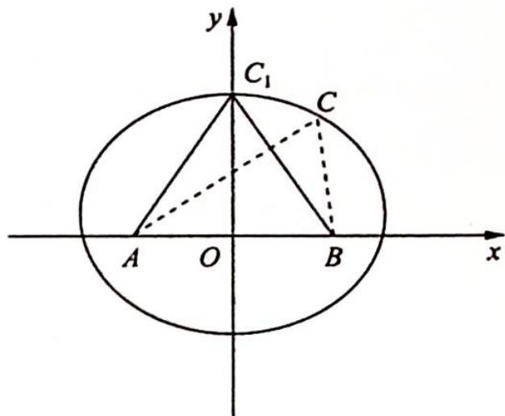

> [!faq]- 《高考数学培优40讲》例题解析
>
> > [!success]- **【答案】** 详见解析
>
> > [!note]- **【分析】**
> > 分析 ▶ 思路一:运用数形结合思想求解,由 $a + b = 4$ ,即点 $C$ 到点 $A$ 和点 $B$ 的距离之和为定值,把点 $A$ 和点 $B$ 看作定点,则点 $C$ 的轨迹是以 $A, B$ 为焦点的椭圆,结合图像可得,当点 $C$ 位于椭圆上、下顶点时, $\triangle ABC$ 的面积有最大值.
> >
> > 思路二: 可运用函数思想求解最值.
>
> > [!note]- **【解析】**
> > 解析 ▶ 解法一(数形结合思想):根据题意可得△ABC为椭圆 $\frac{x^{2}}{4}+\frac{y^{2}}{3}=1$ 的焦点三角形,由图像可得当点C位于椭圆的上顶点 $C_{1}$ 时,△ABC的面积有最大值, $(S_{\triangle ABC})_{\max}=\frac{1}{2}AB\cdot OC_{1}=\frac{1}{2}\times2\times\sqrt{3}=\sqrt{3}$ .
> > 
> > $$
> > S _ {\triangle A B C} = \frac {1}{2} a b \sin C = \frac {1}{2} a b \sqrt {1 - \cos^ {2} C}
> > $$
> > $$
> > \cos C =
> > $$
> > $$
> > \frac {a ^ {2} + b ^ {2} - c ^ {2}}{2 a b}
> > $$
> > $$
> > \begin{array}{r l} S _ {\triangle A B C} & = \frac {1}{2} a b \sqrt {1 - \left(\frac {a ^ {2} + b ^ {2} - c ^ {2}}{2 a b}\right) ^ {2}} = \frac {1}{4} \sqrt {(2 a b) ^ {2} - (a ^ {2} + b ^ {2} - c ^ {2}) ^ {2}} \\ & = \frac {1}{4} \sqrt {(2 a b + a ^ {2} + b ^ {2} - c ^ {2}) (2 a b - a ^ {2} - b ^ {2} + c ^ {2})} \\ & = \frac {1}{4} \sqrt {[ (a + b) ^ {2} - c ^ {2} ] [ c ^ {2} - (a - b) ^ {2} ]}. \end{array}
> > $$
> > 又 $a + b = 4$ ，且 $c = 2$ ，当 $a = b$ 时， $S_{\triangle ABC}$ 取最大值为 $\frac{1}{4}\sqrt{(4^2 - 2^2) \times 2^2} = \sqrt{3}$ .
> > ## 评注 →
> > 解法一体现数形结合思想, 解法二体现函数思想, 解法具有一般性, 若已知 $c$ 和 $a, b$ 之间的数量关系, 可尝试使用函数方法.
