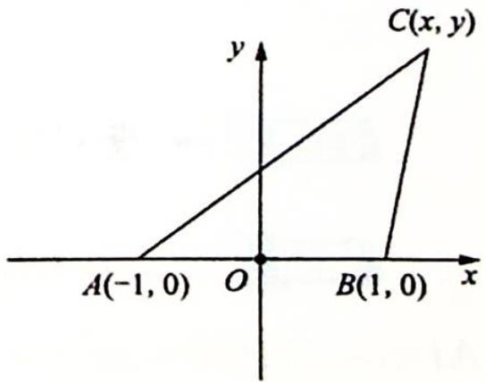

> [!faq]- 《高考数学培优40讲》例题解析
>
> > [!success]- **【答案】** 详见解析
>
> > [!note]- **【分析】**
> > 分析 ➤ 其一运用数形结合思想求解: $b = \sqrt{2}a$ , 即点 $C$ 到点 $B$ 和点 $A$ 的距离之比为定值, 把点 $A$ 和点 $B$ 看作定点, 则点 $C$ 的轨迹是阿波罗尼斯圆, 圆心在直线 $AB$ 上, 把线段 $AB$ 看
> >
> > 作 $\triangle ABC$ 的底边, 则当高为半径时面积有最大值. 其二也可运用函数思想求解最值.
>
> > [!note]- **【解析】**
> > 解析 ▶ 解法一(数形结合思想):根据题意,以 AB 的中点为原点,建立如图所示的平面直角坐标系 xOy.
> > 
> > 设点 C 的坐标为 $(x, y)$ ， $b = \sqrt{2} a$ ，即 $AC = \sqrt{2} BC, (x + 1)^{2} + y^{2} =$
> > $2 \times [(x-1)^{2} + y^{2}], x^{2} + 2x + 1 + y^{2} = 2x^{2} - 4x + 2 + 2y^{2}$ , 即 $(x-3)^{2} + y^{2} = 8$ , 则点 $C$ 的轨迹为以(3,0)为圆心, $2\sqrt{2}$ 为半径的圆.
> > 所以当 $\triangle ABC$ 以 $AB$ 为底边时，高最大为 $2\sqrt{2}$ ，故 $(S_{\triangle ABC})_{\max} = \frac{1}{2} \times 2 \times 2\sqrt{2} = 2\sqrt{2}$ .
> > 解法二（函数思想）： $S_{\triangle ABC} = \frac{1}{2} ab \sin C = \frac{1}{2} ab \sqrt{1 - \cos^2 C}$ ，且 $\cos C = \frac{a^2 + b^2 - c^2}{2ab}$ ，即
> > $$
> > \begin{array}{r l} S _ {\triangle A B C} & = \frac {1}{2} a b \sqrt {1 - \left(\frac {a ^ {2} + b ^ {2} - c ^ {2}}{2 a b}\right) ^ {2}} = \frac {1}{4} \sqrt {(2 a b) ^ {2} - (a ^ {2} + b ^ {2} - c ^ {2}) ^ {2}} \\ & = \frac {1}{4} \sqrt {(2 a b + a ^ {2} + b ^ {2} - c ^ {2}) (2 a b - a ^ {2} - b ^ {2} + c ^ {2})} \\ & = \frac {1}{4} \sqrt {[ (a + b) ^ {2} - c ^ {2} ] [ c ^ {2} - (a - b) ^ {2} ]}. \end{array}
> > $$
> > 又 $b = \sqrt{2} a, c = 2$ ，则 $S_{\triangle ABC} = \frac{1}{4}\sqrt{\left[(\sqrt{2} + 1)^2a^2 - 4\right]\left[4 - (\sqrt{2} - 1)^2a^2\right]}$ $= \frac{1}{4}\sqrt{4(\sqrt{2} + 1)^2a^2 - a^4 - 16 + 4(\sqrt{2} - 1)^2a^2} = \frac{1}{4}\sqrt{-a^4 + 24a^2 - 16}$ $= \frac{1}{4}\sqrt{-(a^2 - 12)^2 + 128} \leqslant \frac{1}{4} \times 8\sqrt{2} = 2\sqrt{2}$ .
> > 当且仅当 $a=2\sqrt{3}$ 时, 取等号. 故 $\triangle ABC$ 面积的最大值为 $2\sqrt{2}$ .
