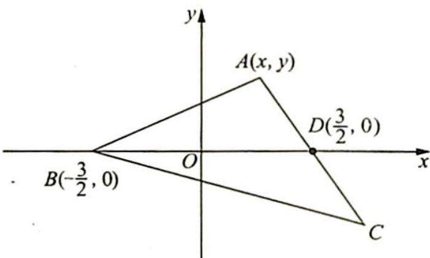

> [!faq]- 《高考数学培优40讲》例题解析
>
> > [!success]- **【答案】** 详见解析
>
> > [!note]- **【分析】**
> > 本题未单列分析。
>
> > [!note]- **【解析】**
> > 解析 ▶ 根据题意,以 BD 的中点为原点,建立如图所示的平面直角坐标系 xOy.
> > 设点 A 的坐标为 $(x, y)$ ，根据题意可得 AB = AC = 2AD，
> > 所以 $\left(x+\frac{3}{2}\right)^{2}+y^{2}=4\left[\left(x-\frac{3}{2}\right)^{2}+y^{2}\right]$ ，得 $\left(x-\frac{5}{2}\right)^{2}+y^{2}=4$ ，则
> > 
> > 点 A 的轨迹为以 $\left(\frac{5}{2},0\right)$ 为圆心，以 2 为半径的圆，即当 $\triangle ABD$ 以 AD 为底边时，高最大为 2，所以 $(S_{\triangle ABD})_{\max}=\frac{1}{2}\times3\times2=3,(S_{\triangle ABC})_{\max}=2(S_{\triangle ABD})_{\max}=6$ ，故 $\triangle ABC$ 面积的最大值为 6.
