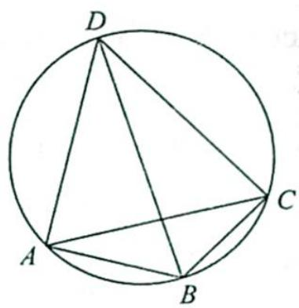
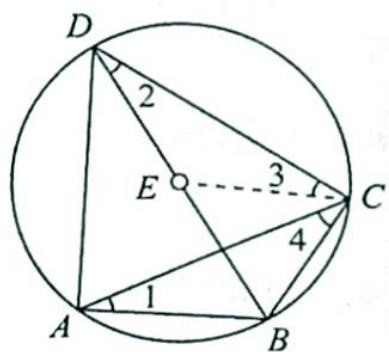
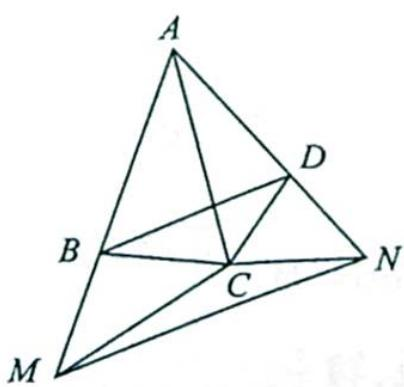

## 25.4 四边形问题

研究密钥

托勒密定理: 圆内接四边形中, 两条对角线的乘积等于两组对边乘积之和, 即若四边形 ABCD 内接于圆, 如图 1 所示, 则有 $AB \cdot CD + AD \cdot BC = AC \cdot BD$ .

等价叙述:四边形的两组对边之积的和等于两对角线之积的充要条件是四顶点共圆.

图 1

证明:如图2所示,过点C作 $\angle DCE=\angle ACB$ ,即 $\angle3=\angle4$ ,易证 $\triangle ACB\sim\triangle DCE$ ,则 $\frac{AB}{AC}=\frac{DE}{DC}$ ,即 $AB\cdot CD=AC\cdot DE$ .

同理 $\triangle ADC \sim \triangle BEC$ ，则 $\frac{AD}{AC} = \frac{BE}{BC}$ ，即 $AD \cdot BC = AC \cdot BE$ ，所以 $AB \cdot CD + AD \cdot BC = AC \cdot DE + AC \cdot BE = AC \cdot BD$ .

图 2

托勒密定理推广(广义托勒密公式): 在四边形 ABCD 中, 有 AB·CD+AD·BC≥AC·BD.

当且仅当四边形 ABCD 内接于圆时, 等式成立.

证明:如图3所示,在边AB或其延长线上取一点M,在边AD或其延长线上取一点N,使得 $AB\cdot AM=AC^{2}=AD\cdot AN$ .

图 3

连接 MC, NC, MN, 则 $\triangle ABC \sim \triangle ACM$ . 于是 $MC = BC \cdot \frac{AC}{AB}$ . 同理, $NC = CD \cdot \frac{AC}{AD}$ .

又 $\triangle ABD \sim \triangle ANM$ , 则 $MN = BD \cdot \frac{AM}{AD} = \frac{BD}{AD} \cdot \frac{AC^{2}}{AB}$ .

由于 $MN \leqslant CM + CN$ ，结合上面几个式子得 $\frac{BD}{AD} \cdot \frac{AC^{2}}{AB} \leqslant BC \cdot \frac{AC}{AB} + CD \cdot \frac{AC}{AD}$ ，去分母并化简得 $AB \cdot CD + AD \cdot BC \geqslant AC \cdot BD$ ，当且仅当 M, C, N 三点共线时，上式等号成立。

此时, $\angle ABC + \angle ADC = \angle ACM + \angle ACN = 180^{\circ}$ , 即 $A, B, C, D$ 四点共圆.

![[高中/总复习/专题/高考数学培优40讲/高考数学培优40讲-03-三角、向量、数列、不等式与复数/第25讲_解三角形/25_4_四边形问题/例题/Q00019768.md]]
![[高中/总复习/专题/高考数学培优40讲/高考数学培优40讲-03-三角、向量、数列、不等式与复数/第25讲_解三角形/25_4_四边形问题/例题/Q00019769.md]]
![[高中/总复习/专题/高考数学培优40讲/高考数学培优40讲-03-三角、向量、数列、不等式与复数/第25讲_解三角形/25_4_四边形问题/例题/Q00019770.md]]
![[高中/总复习/专题/高考数学培优40讲/高考数学培优40讲-03-三角、向量、数列、不等式与复数/第25讲_解三角形/25_4_四边形问题/例题/Q00019771.md]]
![[高中/总复习/专题/高考数学培优40讲/高考数学培优40讲-03-三角、向量、数列、不等式与复数/第25讲_解三角形/25_4_四边形问题/例题/Q00019772.md]]
