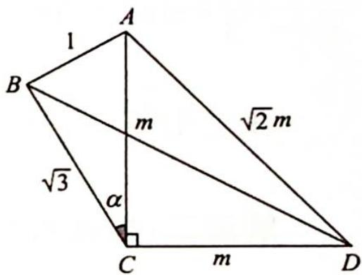

> [!faq]- 《高考数学培优40讲》例题解析
>
> > [!success]- **【答案】** 详见解析
>
> > [!note]- **【分析】**
> > 分析 ▶ 思路一:如图所示,BD 在△BCD 中,使用余弦定理可得 $BD^{2}=m^{2}+3+2\sqrt{3}msin\alpha$ , 在△ABC 中使用余弦定理可得 $m^{2}=4-2\sqrt{3}\cos\angle ABC$ , 使用正弦定理可得 $msin\alpha=\sin\angle ABC$ , 最后化为同角同函再求最值.
> >
> > 
> >
> > 思路二: 直接应用托勒密定理 $AB \cdot CD + AD \cdot BC \geqslant AC \cdot BD$ .
>
> > [!note]- **【解析】**
> > 解析 ▶ 解法一: 在 $\triangle BCD$ 中, 设 $AC=CD=m$ , $\angle ACB=\alpha$ , $BD^{2}=BC^{2}+CD^{2}-2BC\cdot CD\cdot\cos\left(\frac{\pi}{2}+\alpha\right)=3+m^{2}-2\sqrt{3}m(-\sin\alpha)=m^{2}+3+2\sqrt{3}m\sin\alpha.$
> > 在 $\triangle ABC$ 中， $\frac{1}{\sin\alpha}=\frac{m}{\sin\angle ABC}$ ，即 $\sin\angle ABC=m\sin\alpha$ ，又因为 $m^{2}=1+3-2\times1\times\sqrt{3}\cos\angle ABC=4-2\sqrt{3}\cos\angle ABC$ ，所以 $BD^{2}=7-2\sqrt{3}\cos\angle ABC+2\sqrt{3}\sin\angle ABC=7+2\sqrt{6}\sin\left(\angle ABC-\frac{\pi}{4}\right)$ .
> > 当 $\angle ABC = \frac{3\pi}{4}$ 时， $(BD^2)_{\max} = 7 + 2\sqrt{6} = (\sqrt{6} + 1)^2$ ，故 $BD_{\max} = \sqrt{6} + 1$ .
> > 解法二:根据托勒密定理可得 $AB \cdot CD + AD \cdot BC \geqslant AC \cdot BD$ ，即 $m + \sqrt{6}m \geqslant m \cdot BD$ ，所以 $BD \leqslant 1 + \sqrt{6}$ ，故 BD 长的最大值为 $1 + \sqrt{6}$ .
