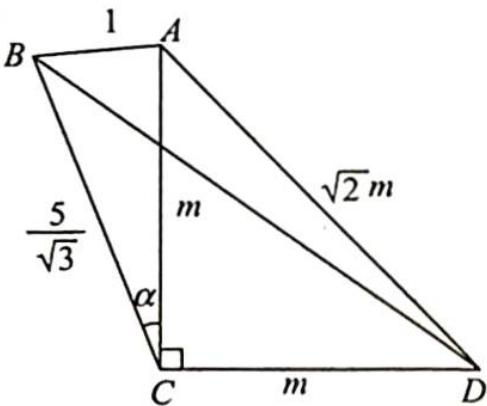

> [!faq]- 《高考数学培优40讲》例题解析
>
> > [!success]- **【答案】** 详见解析
>
> > [!note]- **【分析】**
> > 本题未单列分析。
>
> > [!note]- **【解析】**
> > 解析 ▶ 解法一: 如图所示, 设 $\angle ACB = \alpha$ , 由题意可得 AB = 1, $BC = \frac{5}{\sqrt{3}}$ , 设 AC = CD = m, 在 $\triangle BCD$ 中, $BD^{2} = BC^{2} + CD^{2} - 2BC \cdot CD \cdot \cos\left(\frac{\pi}{2} + \alpha\right) = \frac{25}{3} + m^{2} + \frac{10\sqrt{3}}{3}m \sin\alpha.$
> > 
> > 在 $\triangle ABC$ 中, $\frac{1}{\sin\alpha}=\frac{m}{\sin\angle ABC}$ ,即 $m\sin\alpha=\sin\angle ABC$ ,且 $AC^{2}=AB^{2}+BC^{2}-2AB\cdot BC\cdot\cos\angle ABC$ ,即 $m^{2}=1+\frac{25}{3}-2\times1\times\frac{5}{\sqrt{3}}\times\cos\angle ABC$ ,所以 $BD^{2}=\frac{25}{3}+m^{2}+\frac{10\sqrt{3}}{3}m\sin\alpha=\frac{25}{3}+\left(1+\frac{25}{3}-2\times1\times\frac{5}{\sqrt{3}}\times\cos\angle ABC\right)+\frac{10\sqrt{3}}{3}\sin\angle ABC=\frac{53}{3}+\frac{10\sqrt{3}}{3}\left(\sin\angle ABC-\cos\angle ABC\right)=\frac{53}{3}+\frac{10\sqrt{6}}{3}\sin\left(\angle ABC-\frac{\pi}{4}\right)$ .
> > 当 $\angle ABC = \frac{3\pi}{4}$ 时， $BD$ 有最大值，此时 $(BD^2)_{\max} = \frac{53 + 10\sqrt{6}}{3}$ ，所以 $\angle ABC$ 的大小为 $\frac{3\pi}{4}$ .
> > 解法二:根据托勒密定理可得 $AB \cdot CD + AD \cdot BC \geqslant AC \cdot BD$ ，即 $m + \frac{5}{\sqrt{3}} \cdot \sqrt{2} m \geqslant m \cdot BD$ ， $1+\frac{5\sqrt{6}}{3}\geqslant BD.$
> > 当 A, B, C, D 四点共圆时, 取得等号, 此时 $\angle ABC + \angle ADC = \pi$ , 又因为 $\angle ADC = \frac{\pi}{4}$ , 所以 $\angle ABC$ 的大小为 $\frac{3\pi}{4}$ .
