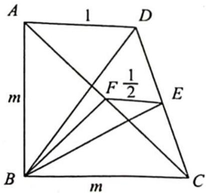

> [!faq]- 《高考数学培优40讲》例题解析
>
> > [!success]- **【答案】** 详见解析
>
> > [!note]- **【分析】**
> > 本题未单列分析。
>
> > [!note]- **【解析】**
> > 解析 如图所示,记 $CD, AC$ 的中点分别为 $E, F$ , 设 $AB = BC = m$ .
> > 根据题意可得 $BF = \frac{1}{2} AC = \frac{\sqrt{2}}{2} m, CF = \frac{1}{2} AC = \frac{\sqrt{2}}{2} m, CE = \frac{1}{2} CD = 1$ .
> > 在四边形 $BCEF$ 中,根据托勒密定理可得 $FB \cdot EC + FE \cdot BC \geqslant BE \cdot CF$ , 即 $\frac{\sqrt{2}}{2} m + \frac{1}{2} m \geqslant \frac{\sqrt{2}}{2} m \cdot BE, BE \leqslant 1 + \frac{\sqrt{2}}{2}$ , 当 $B, C, E, F$ 四点共圆时, 取得等号，所以 $S_{\triangle BCD} \leqslant \frac{1}{2} CD \cdot (BE)_{\max} = \frac{1}{2} \times 2 \times \left(1 + \frac{\sqrt{2}}{2}\right) = 1 + \frac{\sqrt{2}}{2}$ .
> > 
