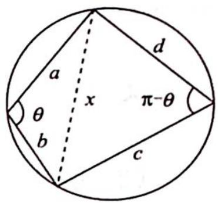

> [!faq]- 《高考数学培优40讲》例题解析
>
> > [!success]- **【答案】** 详见解析
>
> > [!note]- **【分析】**
> > 分析 如图所示, 做辅助线将四边形分割为两个三角形, 则四边形的面积等于两个三角形面积之和, 在两个三角形中分别使用余弦定理, 可求得 $\cos \theta$ , 将 $\sin \theta = \sqrt{1 - \cos^2 \theta}$ 代入面积公式即可证明.
> >
> > 
>
> > [!note]- **【解析】**
> > 解析 如图所示, 由余弦定理得 $a^2 + b^2 - 2ab\cos \theta = x^2 = c^2 + d^2 + 2cd\cos \theta \Rightarrow \cos \theta = \frac{a^2 + b^2 - c^2 - d^2}{2(ab + cd)}$ , 所以
> > $$
> > \begin{array}{r l} & S = \frac {1}{2} a b \sin \theta + \frac {1}{2} c d \sin (\pi - \theta) = \frac {a b + c d}{2} \sin \theta \\ & \quad = \frac {a b + c d}{2} \sqrt {1 - \cos^ {2} \theta} = \frac {a b + c d}{2} \sqrt {1 - \left(\frac {a ^ {2} + b ^ {2} - c ^ {2} - d ^ {2}}{2 a b + 2 c d}\right) ^ {2}} \\ & \quad = \frac {1}{4} \sqrt {(2 a b + 2 c d) ^ {2} - (a ^ {2} + b ^ {2} - c ^ {2} - d ^ {2}) ^ {2}} \\ & \quad = \frac {1}{4} \sqrt {(2 a b + 2 c d + a ^ {2} + b ^ {2} - c ^ {2} - d ^ {2}) (2 a b + 2 c d - a ^ {2} - b ^ {2} + c ^ {2} + d ^ {2})} \\ & \quad = \frac {1}{4} \sqrt {\left[ (a + b) ^ {2} - (c - d) ^ {2} \right] \left[ (c + d) ^ {2} - (a - b) ^ {2} \right]} \\ & \quad = \frac {1}{4} \sqrt {(a + b + c - d) (a + b - c + d) (c + d + a - b) (c + d - a + b)} \\ & \quad = \sqrt {(P - d) (P - c) (P - b) (P - a)}. \end{array}
> > $$
> > 通过圆内接四边形面积公式的证明, 思考如何推导三角形面积的海伦公式: $S = \sqrt{p(p - a)(p - b)(p - c)}$ , 其中 $p = \frac{a + b + c}{2}$ .
