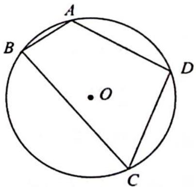
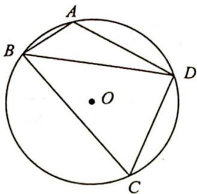

> [!faq]- 《高考数学培优40讲》例题解析
>
> > [!success]- **【答案】** 详见解析
>
> > [!note]- **【分析】**
> > 本题未单列分析。
>
> > [!note]- **【解析】**
> > 
> > 解析 (1) 因为四边形 $ABCD$ 内接于圆 $O$ , 所以 $A + C = \pi$ , 即
> > $\cos A = -\cos C$ , 如图所示, 连接 BD.
> > 在 $\triangle ABD$ 中， $BD^{2}=AB^{2}+AD^{2}-2AB\cdot AD\cos A=4+16-2\times 2\times 4\cos A.$
> > 在 $\triangle BCD$ 中， $BD^{2}=BC^{2}+CD^{2}-2BC\cdot CD\cos C=36+16+2\times6\times$
> > 
> > $4\cos A$ ，所以 $20 - 16\cos A = 52 + 48\cos A$ ，解得 $\cos A = -\frac{1}{2}$
> > 又 $A \in (0, \pi)$ , 则 $A = \frac{2\pi}{3}$ .
> > (2)由(1)可得 $A=\frac{2\pi}{3}$ , $C=\frac{\pi}{3}$ ，所以 $S_{2}=S_{\triangle ABD}+S_{\triangle BCD}=\frac{1}{2}AB\cdot AD\sin\angle A+\frac{1}{2}BC\cdot CD\sin C=\frac{1}{2}\times2\times4\times\frac{\sqrt{3}}{2}+\frac{1}{2}\times6\times4\times\frac{\sqrt{3}}{2}=2\sqrt{3}+6\sqrt{3}=8\sqrt{3}.$
> > 在 $\triangle ABD$ 中,根据正弦定理可得 $\frac{BD}{\sin A}=2R$ ,而 $BD=\sqrt{20-16\cos A}=2\sqrt{7}$ ,所以 $2R=\frac{2\sqrt{7}}{\frac{\sqrt{3}}{2}}=\frac{4\sqrt{21}}{3}$ ,则 $R=\frac{2\sqrt{21}}{3},S_{1}=\pi R^{2}=\frac{4\times21}{9}\pi=\frac{28}{3}\pi.$
> > 借助圆内接四边形面积公式,对于快速解题大有裨益.
