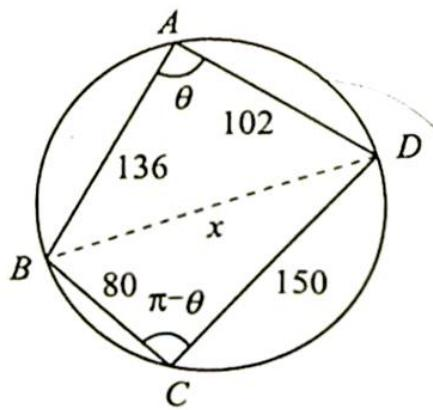

<!-- question-source:start -->
2. 如图所示, 圆内接四边形 $ABCD$ 中, $AB=136$ , $BC=80$ , $CD=150$ , $AD=102$ , 则它的外接圆直径为( ). A. 170 B. 180 C. $8 \sqrt{605}$ D. 以上答案都不对

<!-- question-source:end -->

![[Q00019774A1]]
