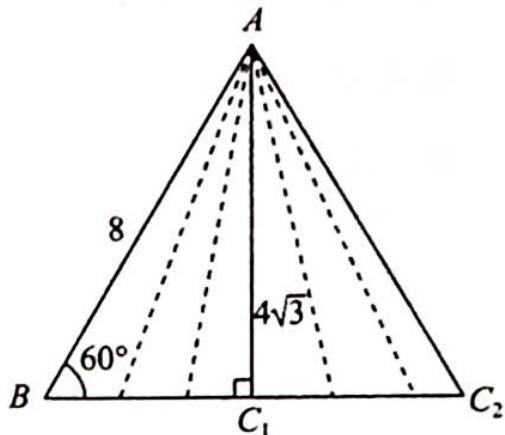

> [!faq]- 《高考数学培优40讲》参考答案
>
> > [!success]- **【答案】** 详见解析
>
> > [!note]- **【分析】**
> > 本题未单列分析。
>
> > [!note]- **【解析】**
> > 如图所示, 当点 $C$ 位于图中点 $C_{1}$ 的位置时, $\triangle ABC$ 只有一个解, 此时 $AC = 4\sqrt{3}$ .
> > 当点 $C$ 位于图中点 $C_{2}$ 的位置时, $\triangle ABC$ 只有一个解, 此时 $AC = 8$ .
> > 要使得 $\triangle ABC$ 有 2 个解, 则 $k$ 的取值范围是 $(4\sqrt{3}, 8)$ .
> > 
> > $$
> > \triangle A C D
> > $$
