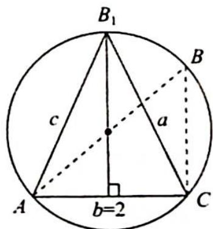

> [!faq]- 《高考数学培优40讲》参考答案
>
> > [!success]- **【答案】** 详见解析
>
> > [!note]- **【分析】**
> > 本题未单列分析。
>
> > [!note]- **【解析】**
> > (1)已知 $a=b\cos C+c\sin B$ ，边化角可得 $\sin A=\sin B\cos C+\sin C\sin B$ ，因为 $A+B+C=\pi$ ，所以 $\sin A=\sin(B+C)=\sin B\cos C+\cos B\sin C$ ，则 $\sin B=\cos B$ ，故 $B=\frac{\pi}{4}$ .
> > $$
> > B = \frac {\pi}{4}
> > $$
> > 当点 B 位于点 $B_{1}$ 的位置时， $\triangle ABC$ 的面积有最大值，此时 a = c，设 a = c = x，因为 $\cos\angle45^{\circ}=\frac{a^{2}+c^{2}-b^{2}}{2ac}$ ，即 $\frac{\sqrt{2}}{2}=\frac{2x^{2}-4}{2x^{2}}=1-\frac{2}{x^{2}}$ ，所以 $x^{2}=4+2\sqrt{2}$ ， $S_{\triangle ABC}=\frac{1}{2}ac\sin B=\frac{1}{2}\cdot x^{2}\cdot\frac{\sqrt{2}}{2}=\frac{\sqrt{2}}{4}(4+2\sqrt{2})=\sqrt{2}+1.$
> > 
