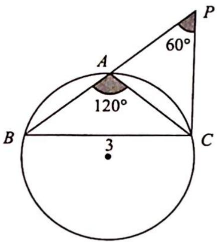
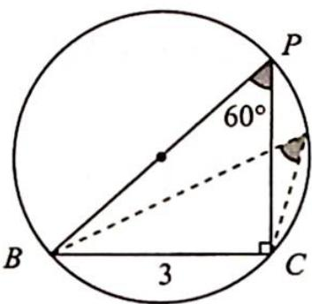

> [!faq]- 《高考数学培优40讲》参考答案
>
> > [!success]- **【答案】** 详见解析
>
> > [!note]- **【分析】**
> > 本题未单列分析。
>
> > [!note]- **【解析】**
> > (1)已知 $\sin^{2}A - \sin^{2}B - \sin^{2}C = \sin B \sin C$ ，角化边可得 $a^{2} - b^{2} - c^{2} = bc$ ，即 $b^{2} + c^{2} - a^{2} = -bc$ ，所以 $\cos A = \frac{b^{2} + c^{2} - a^{2}}{2bc} = -\frac{1}{2}$ ，又 $A \in (0, \pi)$ ，所以 $A = \frac{2\pi}{3}$ .
> > (2)如图1所示,延长BA到点P,使得AP=AC,所以 $AB+AC=AB+AP=BP$ ,要使得△ABC周长最大,则需要满足BP长度最大.
> > 将问题转化为已知一边 a=3 及其对角 $\angle P=60^{\circ}$ ，求另一边 BP 的最大值.
> > 由图2可得，当 $BP$ 为 $\triangle BPC$ 的外接圆的直径时最大，故 $BP_{\mathrm{max}} = \frac{3}{\sin 60^{\circ}} = 2\sqrt{3}$ ，所以 $\triangle ABC$ 周长的最大值为 $C_{\triangle ABC} = 3 + 2\sqrt{3}$ .
> > 
> > 图1
> > 
> > 图 2
