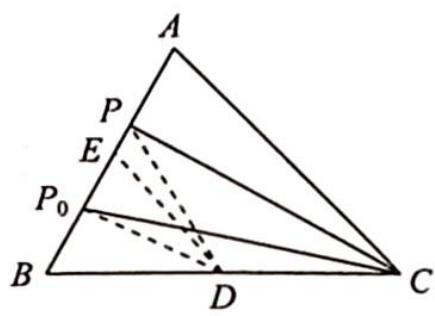

> [!faq]- 《高考数学培优40讲》例题解析
>
> > [!success]- **【答案】** D
>
> > [!note]- **【分析】**
> > 分析 ▶ $\overrightarrow{PB} \cdot \overrightarrow{PC} \geqslant \overrightarrow{P_{0}B} \cdot \overrightarrow{P_{0}C}$ 表明 $\overrightarrow{P_{0}B} \cdot \overrightarrow{P_{0}C}$ 是 $\overrightarrow{PB} \cdot \overrightarrow{PC}$ 的最小值, 目标应是探究 $\overrightarrow{PB} \cdot \overrightarrow{PC}$ 的变化情况. 因此尝试极化恒等式处理, 先取 BC 的中点 D, 则 $\overrightarrow{PB} \cdot \overrightarrow{PC}$ 与 $\overrightarrow{P_{0}B} \cdot \overrightarrow{P_{0}C}$ 可同时转化为两组线段 PD 和 BD, $P_{0}D$ 和 BD 的平方差, 再转化为 PD 与 $P_{0}D$ 的关系, 由垂线段最短
> >
> > 得 $P_{0}D \perp AB$ .
>
> > [!note]- **【解析】**
> > 解析 如图所示,取 BC 的中点 D,连接 PD,P₀D.
> > 在 $\triangle PBC$ 内使用极化恒等式得 $\overrightarrow{PB} \cdot \overrightarrow{PC} = |\overrightarrow{PD}|^{2} - |\overrightarrow{BD}|^{2}$ ; 在 $\triangle P_{0}BC$ 内使用极化恒等式得 $\overrightarrow{P_{0}B} \cdot \overrightarrow{P_{0}C} = |\overrightarrow{P_{0}D}|^{2} - |\overrightarrow{BD}|^{2}$ , 由条件恒有 $|\overrightarrow{PD}|^{2} \geqslant |\overrightarrow{P_{0}D}|^{2}$ , 即 $P_{0}D \perp AB$ .
> > 
> > 取 $AB$ 的中点 $E$ , 连接 $DE$ , 因为 $P_{0}B = \frac{1}{4} AB$ , 所以 $P_{0}$ 为 $BE$ 的中点, 则 $BD = DE$ , 因此 $AC = BC$ , 故选 D.
> > 用极化恒等式的优点就是将向量数量积的关系,转化为两个平面向量的长度关系,即线段的长度,化抽象为具体,使问题变得更直观.
