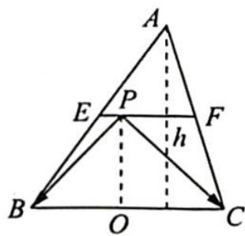
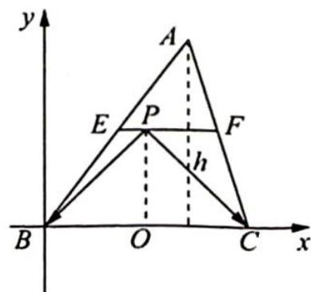

> [!faq]- 《高考数学培优40讲》例题解析
>
> > [!success]- **【答案】** 详见解析
>
> > [!note]- **【分析】**
> > 分析 ▶ 思路一: $\overrightarrow{PB} \cdot \overrightarrow{PC}$ 如何使用公式转化? 从形式上看可使用极化恒等式. 取 BC 的中点 O, $\overrightarrow{PB} \cdot \overrightarrow{PC}$ 使用极化恒等式转化成 $\left|\overrightarrow{PO}\right|^{2} - \frac{1}{4}\left|\overrightarrow{CB}\right|^{2}$ , 则 $\overrightarrow{PB} \cdot \overrightarrow{PC} + \overrightarrow{BC}^{2} = \left|\overrightarrow{PO}\right|^{2} + \frac{3}{4}\left|\overrightarrow{CB}\right|^{2}$ . 另一方面, $\triangle ABC$ 的面积为定值 2, 利用基本不等式积定和最小求出和的最小值.
> >
> > 思路二:建立合适的平面直角坐标系,得出相关点的坐标,对 $\overrightarrow{PB}\cdot\overrightarrow{PC}+\overrightarrow{BC}^{2}$ 进行坐标运算再进一步求最值.
>
> > [!note]- **【解析】**
> > 解析 ▶ 解法一(利用极化恒等式): 如图 1 所示, 取 BC 的中点 O, 连接 PO.
> > $$
> > \overrightarrow {P B} \cdot \overrightarrow {P C} + \overrightarrow {B C} ^ {2} = | \overrightarrow {P O} | ^ {2} - \frac {1}{4} | \overrightarrow {C B} | ^ {2} + \overrightarrow {B C} ^ {2} = | \overrightarrow {P O} | ^ {2} + \frac {3}{4} | \overrightarrow {C B} | ^ {2} \geqslant
> > $$
> > 
> > 图 1
> > $$
> > 2 \sqrt {\left| \overrightarrow {P O} \right| ^ {2} \cdot \frac {3}{4} \left| \overrightarrow {C B} \right| ^ {2}} = \sqrt {3} | \overrightarrow {P O} | | \overrightarrow {C B} |
> > $$
> > 因为 $|\overrightarrow{PO}| \geqslant \frac{1}{2} h$ ，所以 $\sqrt{3} |\overrightarrow{PO}| |\overrightarrow{CB}| \geqslant \frac{\sqrt{3}}{2} h |\overrightarrow{CB}| = \sqrt{3} S_{\triangle ABC} = 2\sqrt{3}$ ，故 $\overrightarrow{PB} \cdot \overrightarrow{PC} + \overrightarrow{BC}^2$ 的最小值是 $2\sqrt{3}$ .
> > 解法二(坐标法):由题意可得△PBC的面积为1,以B为原点,BC所在直线为x轴,过点B与直线BC垂直的直线为y轴,建立平面直角坐标系,如图2所示.
> > 
> > 图2
> > 设 $C(a,0)$ , $P\left(t,\frac{2}{a}\right)(a>0)$ ，则 $\overrightarrow{PB}=\left(-t,-\frac{2}{a}\right)$ ， $\overrightarrow{PC}=\left(a-t,-\frac{2}{a}\right)$ ，所以 $\overrightarrow{PC}\cdot\overrightarrow{PB}+\overrightarrow{BC}^{2}=$ $-t(a-t)+\frac{4}{a^{2}}+a^{2}=\left(t-\frac{a}{2}\right)^{2}+\frac{4}{a^{2}}+\frac{3a^{2}}{4}\geqslant2\sqrt{3}.$
> > 当且仅当 $t = \frac{a}{2}, a = \sqrt[4]{\frac{16}{3}}$ 时取等号，所以 $\overrightarrow{PB} \cdot \overrightarrow{PC} + \overrightarrow{BC}^2$ 的最小值是 $2\sqrt{3}$ .
