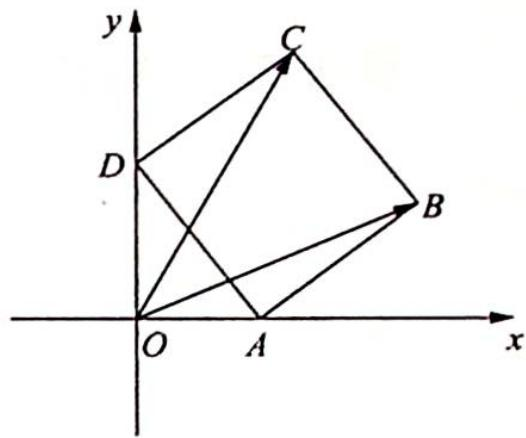
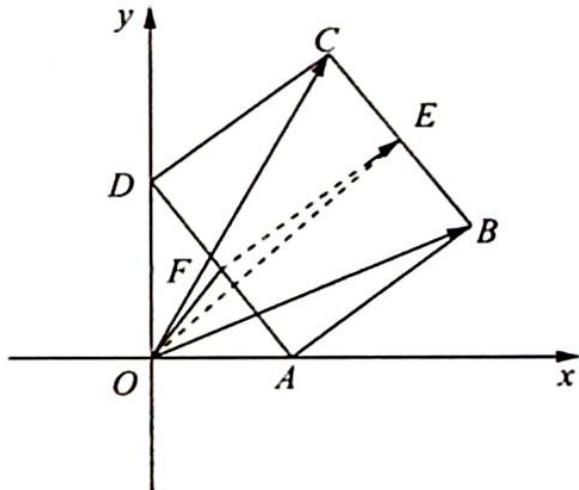

> [!faq]- 《高考数学培优40讲》例题解析
>
> > [!success]- **【答案】** 详见解析
>
> > [!note]- **【分析】**
> > 分析 ▶ 思路一: 利用极化恒等式, 取 BC 的中点 E, 将 $\overrightarrow{OB} \cdot \overrightarrow{OC}$ 转化为 $\left|\overrightarrow{OE}\right|^{2} - \frac{1}{4}\left|\overrightarrow{BC}\right|^{2} = \left|\overrightarrow{OE}\right|^{2} - \frac{1}{4}$ , 这样减少了变量, 只需求 $\left|\overrightarrow{OE}\right|$ 的最大值.
> >
> > 
> >
> > 思路二:考虑坐标法.设出一角,求出相关点的坐标表示,进行数量积的坐标运算建立目标函数,利用三角函数有界性求最值.
>
> > [!note]- **【解析】**
> > 解析 ▶ 解法一(利用极化恒等式): 如图所示, 取 BC, AD 的中点 E, F, $\overrightarrow{OB} \cdot \overrightarrow{OC} = |\overrightarrow{OE}|^{2} - \frac{1}{4} |\overrightarrow{BC}|^{2} = |\overrightarrow{OE}|^{2} - \frac{1}{4}$ .
> > 因为 $|\overrightarrow{OE}| \leqslant OF + EF = \frac{1}{2} + 1 = \frac{3}{2}$ （当 $O, F, E$ 三点共线时取等号），所以 $\overrightarrow{OB} \cdot \overrightarrow{OC} \leqslant \frac{9}{4} - \frac{1}{4} = 2$ ，即 $\overrightarrow{OB} \cdot \overrightarrow{OC}$ 的最大值为 2.
> > 
> > 解法二(坐标法): 设 $\angle ODA = \theta, \theta \in \left[0, \frac{\pi}{2}\right]$ ，则 $A(\sin\theta, 0), D(0, \cos\theta), B(\sin\theta + \cos\theta, \sin\theta)$ ， $C(\cos\theta, \cos\theta + \sin\theta)$ ，所以 $\overrightarrow{OB} \cdot \overrightarrow{OC} = (\sin\theta + \cos\theta, \sin\theta)(\cos\theta, \cos\theta + \sin\theta) = \sin\theta \cos\theta + \cos^{2}\theta + \sin\theta \cos\theta + \sin^{2}\theta = 1 + \sin 2\theta.$
> > 又 $\theta \in \left[0, \frac{\pi}{2}\right]$ , 所以 $\sin 2\theta \in [0,1]$ , 即 $\overrightarrow{OB} \cdot \overrightarrow{OC}$ 的最大值为 2:
