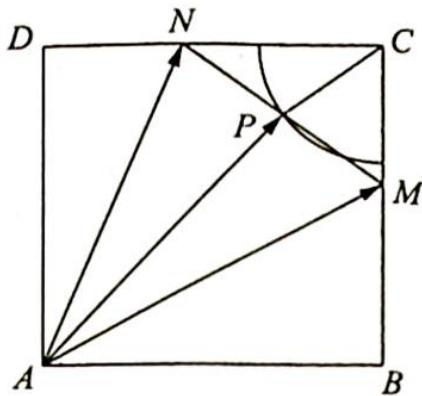

> [!faq]- 《高考数学培优40讲》例题解析
>
> > [!success]- **【答案】** A
>
> > [!note]- **【分析】**
> > 分析 如何把 $\overrightarrow{AM},\overrightarrow{AN}$ 两个“动”的向量转化为“定”的内容？取MN的中点P，由极化恒等式得 $\overrightarrow{AM}\cdot\overrightarrow{AN}=|\overrightarrow{AP}|^{2}-\frac{1}{4}|\overrightarrow{MN}|^{2}=|\overrightarrow{AP}|^{2}-\frac{1}{2}$ ，只需研究 $|\overrightarrow{AP}|$ 的范围即可。
>
> > [!note]- **【解析】**
> > 解析 ▶ 解法一(极化恒等式):如图所示,取MN的中点P,由极化恒等式得 $\overrightarrow{AM} \cdot \overrightarrow{AN}=$ $\left|\overrightarrow{AP}\right|^{2}-\frac{1}{4}\left|\overrightarrow{MN}\right|^{2}=\left|\overrightarrow{AP}\right|^{2}-\frac{1}{2}$ ，又△MNC为直角三角形，所以 $CP=\frac{1}{2}MN=\frac{\sqrt{2}}{2}$ ，所以P在以
> > C 为圆心, $\frac{\sqrt{2}}{2}$ 为半径的圆弧上运动.
> > 故 $|\overrightarrow{AP}| \in \left[\frac{3\sqrt{2}}{2}, \sqrt{2^2 + \left(2 - \frac{\sqrt{2}}{2}\right)^2}\right]$ , 即 $|\overrightarrow{AP}| \in \left[\frac{3\sqrt{2}}{2}, \sqrt{\frac{17}{2} - 2\sqrt{2}}\right]$ , 从
> > 
> > 而 $\overrightarrow{AM} \cdot \overrightarrow{AN} = |\overrightarrow{AP}|^2 - \frac{1}{2} \in [4, 8 - 2\sqrt{2}]$ , 故选 A.
> > 解法二(坐标法): 以 C 为坐标原点, CD, CB 所在的直线分别为 x 轴, y 轴, 设 $\angle MNC = \alpha$ , $\alpha \in \left[0, \frac{\pi}{2}\right]$ , 则 $CM = \sqrt{2} \sin \alpha$ , $CN = \sqrt{2} \cos \alpha$ , 故 $M(0, \sqrt{2} \sin \alpha)$ , $N(\sqrt{2} \cos \alpha, 0)$ .
> > 又 $A(2,2)$ , 所以 $\overrightarrow{AM} \cdot \overrightarrow{AN} = (-2, \sqrt{2}\sin\alpha - 2) \cdot (\sqrt{2}\cos\alpha - 2, -2) = 8 - 2\sqrt{2}\sin\alpha - 2\sqrt{2}\cos\alpha = 8 - 4\sin\left(\alpha + \frac{\pi}{4}\right)$ .
> > 因为 $\alpha \in \left[0, \frac{\pi}{2}\right]$ , 所以 $\alpha + \frac{\pi}{4} \in \left[\frac{\pi}{4}, \frac{3\pi}{4}\right]$ , 故 $\sin \left(\alpha + \frac{\pi}{4}\right) \in \left[\frac{\sqrt{2}}{2}, 1\right]$ , 从而 $\overrightarrow{AM} \cdot \overrightarrow{AN} = 8 - 4\sin \left(\alpha + \frac{\pi}{4}\right) \in [4, 8 - 2\sqrt{2}]$ , 故选 A.
> > 坐标法为一般性方法,也是这类题目的通法. 本题为了方便研究,最好将坐标原点放在 $C$ 处.
