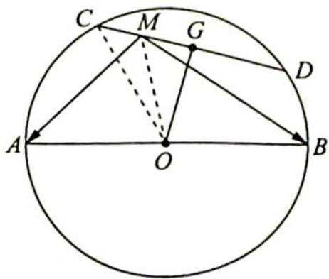

> [!faq]- 《高考数学培优40讲》例题解析
>
> > [!success]- **【答案】** 详见解析
>
> > [!note]- **【分析】**
> > 分析 ➤ 思路一: 考虑极化恒等式. 由极化恒等式得 $\overrightarrow{MA} \cdot \overrightarrow{MB} = |\overrightarrow{MO}|^{2} - \frac{1}{4} |\overrightarrow{AB}|^{2} = |\overrightarrow{MO}|^{2} - 16$ , 这样减少了变量, 问题转化为求 $|\overrightarrow{MO}|$ 的取值范围. 而 M 是弦 CD 上的一个动点, 故此 $|\overrightarrow{MO}|$ 在 $[OG, OC]$ 上变化.
> >
> > 思路二:以 $\overrightarrow{MO}$ , $\overrightarrow{OA}$ 为基底表示出向量 $\overrightarrow{MA}$ , $\overrightarrow{MB}$ ,求出其数量积.
> >
> > 思路三:建立坐标系,将相关点的坐标表示出来,对 $\overrightarrow{MA}\cdot\overrightarrow{MB}$ 进行坐标运算表示为一个函数.
>
> > [!note]- **【解析】**
> > 解析 ▶ 解法一(极化恒等式): 如图所示, 过 O 作 $OG \perp CD$ , 垂足为 G, 连接 OG, OC.
> > 由极化恒等式得 $\overrightarrow{MA} \cdot \overrightarrow{MB} = |\overrightarrow{MO}|^2 - \frac{1}{4} |\overrightarrow{AB}|^2 = |\overrightarrow{MO}|^2 - 16$ , 因为 $|\overrightarrow{MO}| = MO \in [OG, OC]$ , 即 $|\overrightarrow{MO}| \in [\sqrt{7}, 4]$ , 所以 $\overrightarrow{MA} \cdot \overrightarrow{MB} \in [-9, 0]$ .
> > 
> > 解法二(基底法): 因为 $\overrightarrow{MA} \cdot \overrightarrow{MB} = (\overrightarrow{MO} + \overrightarrow{OA}) \cdot (\overrightarrow{MO} + \overrightarrow{OB}) = (\overrightarrow{MO} + \overrightarrow{OA}) \cdot (\overrightarrow{MO} - \overrightarrow{OA}) =$
> > $\overrightarrow{MO}^{2}-\overrightarrow{OA}^{2}=\overrightarrow{MO}^{2}-16$ ，下同解法一.
> > 解法三(坐标法):以 O 为原点,AB 所在的直线为 x 轴,过点 O 且与 AB 垂直的直线为 y 轴建立直角坐标系,则 A(-4,0),B(4,0).设 M(x,y),则 $\overrightarrow{MA} \cdot \overrightarrow{MB} = x^{2} + y^{2} - 16$ ,因为 OM= $\sqrt{x^{2} + y^{2}} \in [\sqrt{7}, 4]$ ,下同解法一.
> > 在三种解法中,极化恒等式最为简洁. 极化恒等式在综合问题的应用中,需要大家恰当地运用转化思想,化动为定,特别是要结合题中的隐性特征进行转化处理,如题中的圆是“定”这一重要条件,化动为定可使得本题快速突破.
