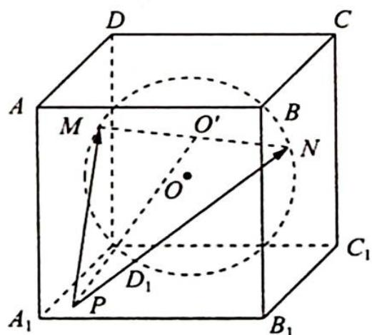

> [!faq]- 《高考数学培优40讲》例题解析
>
> > [!success]- **【答案】** 详见解析
>
> > [!note]- **【分析】**
> > 分析 ➤ 首先理解“MN 最长”, 弦 MN 最长时, 即为球的直径, 此时 MN 的中点为球心 O. 根据极化恒等式, $\overrightarrow{PM} \cdot \overrightarrow{PN} = |\overrightarrow{PO'}|^{2} - \frac{1}{4} |\overrightarrow{MN}|^{2} = |\overrightarrow{PO'}|^{2} - 1$ , 根据题意 $O'$ 即为 O, 因此问题转化为求在正方体表面上的动点到球心 O 的最大值.
>
> > [!note]- **【解析】**
> > 解析 如图所示, 设球心为 O, 球半径为 r, 则 r=1, 因为弦 MN 最长, 所以 $\left|\overrightarrow{MN}\right|=2r=2$ .
> > 根据极化恒等式, $\overrightarrow{PM} \cdot \overrightarrow{PN} = |\overrightarrow{PO}|^2 - \frac{1}{4} |\overrightarrow{MN}|^2 = |\overrightarrow{PO}|^2 - 1$ , 因为 $P$ 为正方体表面上的动点, 所以 $|\overrightarrow{PO}|$ 的最大值为正方体体对角线长的一半, 为 $\sqrt{3}$ .
> > 
> > 故 $\overrightarrow{PM}\cdot\overrightarrow{PN}$ 的最大值为2.
> > ## 评注
> > 向量是连接代数与几何的桥梁,由于向量的坐标运算的引入,向量与代数的互换运算可以说是深入人心,而与几何(平面几何、空间几何)的运算略显单薄,极化恒等式恰恰就弥补了这一“遗憾”,可以认为极化恒等式将向量的数量积问题用形象化的几何图形展现得淋漓尽致.
