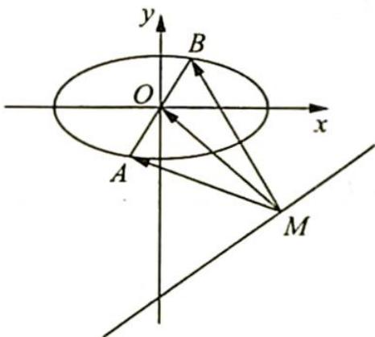
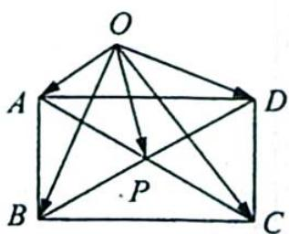

> [!faq]- 《高考数学培优40讲》例题解析
>
> > [!success]- **【答案】** C
>
> > [!note]- **【分析】**
> > 分析 ▶ 线段 AB 是“动”的, M 是直线上的动点.
> >
> > 思路一:利用极化恒等式将 $\overrightarrow{MA}$ , $\overrightarrow{MB}$ 的数量积转化为线段间的关系, 即 $\overrightarrow{MA} \cdot \overrightarrow{MB} = |\overrightarrow{MO}|^{2}-\frac{1}{4}|\overrightarrow{AB}|^{2}$ . 由于 $|\overrightarrow{MO}|$ 与 $|\overrightarrow{AB}|$ 在变化上无关, 所以下面就分别研究 $|\overrightarrow{MO}|$ 的最小值与 $|\overrightarrow{AB}|$ 的最大值即可.
> >
> > 思路二:坐标法.设出 M, A, B 的坐标, 对 $\overrightarrow{MA}, \overrightarrow{MB}$ 进行数量积的坐标运算, 根据其表达式求最值.
>
> > [!note]- **【解析】**
> > 解析 ▶ 解法一(极化恒等式):由极化恒等式得 $\overrightarrow{MA} \cdot \overrightarrow{MB} = |\overrightarrow{MO}|^{2} - \frac{1}{4} |\overrightarrow{AB}|^{2}$ .
> > 因为 $|\overrightarrow{MO}|$ 与 $|\overrightarrow{AB}|$ 之间无关，且 $|\overrightarrow{AB}|_{\max} = 4, |\overrightarrow{MO}|_{\min} = \frac{| - 15|}{5} = 3$ ，从而 $(\overrightarrow{MA} \cdot \overrightarrow{MB})_{\min} =$
> > $\left|\overrightarrow{MO}\right|_{\min}^{2}-\frac{1}{4}\left|\overrightarrow{AB}\right|_{\max}^{2}=5$ ，故选C.
> > 解法二(坐标法):如图所示,设点 $M(x,y)$ , 点 $A(m,n)$ , 则 $B(-m,-n)$ , 且 3x-4y-15=0, $\frac{m^{2}}{4}+n^{2}=1$ , 则 $\overrightarrow{MA}\cdot\overrightarrow{MB}=(m-x,n-y)\cdot(-m-x,-n-y)=x^{2}+y^{2}-(m^{2}+n^{2})$ , 表示原点 O 到点 M 的距离的平
> > 
> > 方减去原点 O 到点 A 的距离的平方, 即 $\overrightarrow{MA} \cdot \overrightarrow{MB} = |\overrightarrow{OM}|^{2} - |\overrightarrow{OA}|^{2}$ , 下同解法一.
> > 2. 极化恒等式在矩形中的应用
> > 研究密钥
> > 在矩形中应用极化恒等式可得如下结论：
> > 【极化恒等式——矩形对角线性质】在矩形 ABCD 中, 平面内任意一点到矩形两对角线顶点的距离平方和相等.
> > 【证明】如图所示,ABCD为矩形,AC与BD相交于点P.
> > 因为 AC=BD，所以 $\overrightarrow{OA} \cdot \overrightarrow{OC} = \overrightarrow{OP}^{2} - \frac{1}{4} \overrightarrow{AC}^{2} = \overrightarrow{OP}^{2} - \frac{1}{4} \overrightarrow{BD}^{2} = \overrightarrow{OB} \cdot \overrightarrow{OD}$ ，又 $(\overrightarrow{OA} + \overrightarrow{OC})^{2} =$
> > $(2\overrightarrow{OP})^{2},(\overrightarrow{OB}+\overrightarrow{OD})^{2}=(2\overrightarrow{OP})^{2}$ ，故 $\overrightarrow{OA}^{2}+\overrightarrow{OC}^{2}+2\overrightarrow{OA}\cdot\overrightarrow{OC}=\overrightarrow{OB}^{2}+\overrightarrow{OD}^{2}+2\overrightarrow{OB}\cdot\overrightarrow{OD}.$
> > 所以 $OA^{2} + OC^{2} = OB^{2} + OD^{2}$ .
> > 
