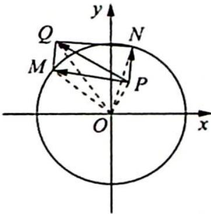

> [!faq]- 《高考数学培优40讲》例题解析
>
> > [!success]- **【答案】** 详见解析
>
> > [!note]- **【分析】**
> > 本题未单列分析。
>
> > [!note]- **【解析】**
> > 解析 如图所示, 连接辅助线 $OM, OQ, ON, OP$ , 则有 $OP^{2} + OQ^{2} = OM^{2} + ON^{2}$ , 解得 $OQ = 3\sqrt{3}, PQ \geqslant OQ - OP = 3\sqrt{3} - \sqrt{5}$ , 当且仅当 $Q, O, P$ 三点共线时等号成立.
> > 
> > 所以 $\left|\overrightarrow{PQ}\right|$ 的最小值为 $3\sqrt{3}-\sqrt{5}$ .
