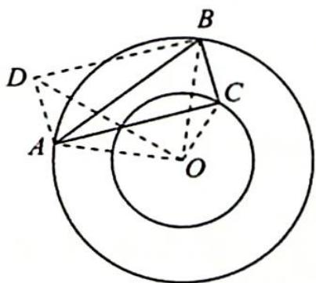

> [!faq]- 《高考数学培优40讲》例题解析
>
> > [!success]- **【答案】** 详见解析
>
> > [!note]- **【分析】**
> > 本题未单列分析。
>
> > [!note]- **【解析】**
> > 解析 如图所示,作一个矩形 ACBD,有 $OC^{2}+OD^{2}=OA^{2}+OB^{2}\Rightarrow OD^{2}=36$ .
> > 在 $\triangle ODC$ 中,有 $DC \leqslant OD + OC = 8$ ,当且仅当 $D, O, C$ 三点共线时等号成立.又 $DC = AB$ ,所以 $AB$ 长度的最大值为8.
> > 
