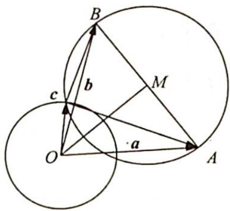
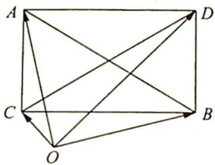

> [!faq]- 《高考数学培优40讲》例题解析
>
> > [!success]- **【答案】** C
>
> > [!note]- **【分析】**
> > 本题未单列分析。
>
> > [!note]- **【解析】**
> > 解析 ▶ 解法一(构造几何图形):依题意构造如图1所示的几何图形,设 $\overrightarrow{OA}=a,\overrightarrow{OB}=b,a-b=\overrightarrow{BA},|a|=|b|=2$ ,且 $|c|=1$ .
> > 若 $(a - c) \perp (b - c)$ , 则 $\odot O$ 与 $\odot M$ 有公共点, 设圆 $O$ 半径为 $r$ , 圆 $M$ 半径为 $R$ , 则 $R - r \leqslant |OM| \leqslant R + r$ .
> > 
> > 因为 $|OM| = \sqrt{4 - R^2}$ ，则 $R - 1 \leqslant \sqrt{4 - R^2} \leqslant R + 1$ ，解得 $\frac{\sqrt{7} - 1}{2} \leqslant R \leqslant \frac{\sqrt{7} + 1}{2}$ ，因此 $|AB| = 2R \in [\sqrt{7} - 1, \sqrt{7} + 1]$ .
> > 图1
> > 所以 $|a-b|$ 的最大值为 $\sqrt{7}+1$ ，故选C.
> > 解法二(利用极化恒等式在矩形中的推广结论):如图2所示,设 $\overrightarrow{OA}=a,\overrightarrow{OB}=b,\overrightarrow{OC}=c$ ,因为 $(a-c)\cdot(b-c)=0$ ,即 $\overrightarrow{CA}\perp\overrightarrow{CB}$ ,又 $\overrightarrow{OC}^{2}+\overrightarrow{OD}^{2}=\overrightarrow{OA}^{2}+\overrightarrow{OB}^{2}$ ,故 $\overrightarrow{OD}^{2}=7$ .
> > 
> > 所以 $|\overrightarrow{CD}| \leqslant |\overrightarrow{OC}| + |\overrightarrow{OD}| = \sqrt{7} + 1$ ，故选C.
> > 图 2
