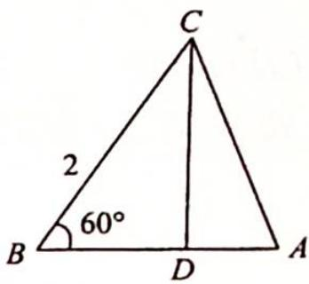

> [!faq]- 《高考数学培优40讲》例题解析
>
> > [!success]- **【答案】** 详见解析
>
> > [!note]- **【分析】**
> > 本题未单列分析。
>
> > [!note]- **【解析】**
> > 解析 如图所示,根据向量数乘余弦定理有 $\overrightarrow{AB}\cdot\overrightarrow{AC}=\frac{b^{2}+c^{2}-4}{2}$ .
> > 
> > 由余弦定理得 $b^{2} = a^{2} + c^{2} - 2ac\cos B = c^{2} - 2c + 4$ ，所以 $\overrightarrow{AB}\cdot \overrightarrow{AC} = c(c - 1) > 0$ $\Rightarrow c > 1,\triangle ABC$ 为锐角三角形 $\Rightarrow A\in \left(\frac{\pi}{6},\frac{\pi}{2}\right)\Rightarrow \sin A\in \left(\frac{1}{2},1\right).$ 由正弦定理得 $\frac{a}{\sin A} =$ $\frac{b}{\sin B}\Rightarrow b = \frac{\sqrt{3}}{\sin A}\in (\sqrt{3},2\sqrt{3})$ ，所以 $b^{2}\in (3,12),3 <   c^{2} - 2c + 4 <   12\Rightarrow 1 <   c <   4.$
> > 故 $\overrightarrow{AB}\cdot\overrightarrow{AC}=c(c-1)\in(0,12)$ .
