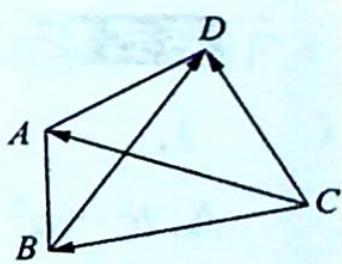

## 26.6 对角线向量定理

研究密钥

对角线向量定理: $\overrightarrow{AC} \cdot \overrightarrow{BD} = \frac{(\overrightarrow{AD}^{2} + \overrightarrow{BC}^{2}) - (\overrightarrow{AB}^{2} + \overrightarrow{CD}^{2})}{2}$ 【证明】如图所示，在△ABC中，由向量数乘余弦定理有 $\overrightarrow{CA}\cdot\overrightarrow{CB}=\frac{\overrightarrow{CA}^{2}+\overrightarrow{CB}^{2}-\overrightarrow{AB}^{2}}{2}$ .

在 $\triangle ADC$ 中,同理有 $\overrightarrow{CA}\cdot\overrightarrow{CD}=\frac{\overrightarrow{CA}^{2}+\overrightarrow{CD}^{2}-\overrightarrow{AD}^{2}}{2}$ .

所以在四边形 ABCD 中，有 $\overrightarrow{AC} \cdot \overrightarrow{BD} = \overrightarrow{AC} \cdot (\overrightarrow{CD} - \overrightarrow{CB}) = \frac{(\overrightarrow{AD}^{2} + \overrightarrow{BC}^{2}) - (\overrightarrow{AB}^{2} + \overrightarrow{CD}^{2})}{2}$ .

推论 1: 当 $\overrightarrow{AC} \perp \overrightarrow{BD}$ 时, 有 $\overrightarrow{AD}^{2} + \overrightarrow{BC}^{2} = \overrightarrow{AB}^{2} + \overrightarrow{CD}^{2}$ .

推论 2: $\cos\langle\overrightarrow{AC}\cdot\overrightarrow{BD}\rangle=\frac{(\overrightarrow{AD}^{2}+\overrightarrow{BC}^{2})-(\overrightarrow{AB}^{2}+\overrightarrow{CD}^{2})}{2|\overrightarrow{AC}||\overrightarrow{BD}|}$ .

![[高中/总复习/专题/高考数学培优40讲/高考数学培优40讲-03-三角、向量、数列、不等式与复数/第26讲_平面向量等值线模型与常见恒等式/平面向量中的常见恒等式/26_6_对角线向量定理/例题/Q00019810.md]]
![[高中/总复习/专题/高考数学培优40讲/高考数学培优40讲-03-三角、向量、数列、不等式与复数/第26讲_平面向量等值线模型与常见恒等式/平面向量中的常见恒等式/26_6_对角线向量定理/例题/Q00019811.md]]
![[高中/总复习/专题/高考数学培优40讲/高考数学培优40讲-03-三角、向量、数列、不等式与复数/第26讲_平面向量等值线模型与常见恒等式/平面向量中的常见恒等式/26_6_对角线向量定理/例题/Q00019812.md]]
