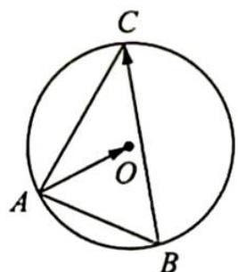

> [!faq]- 《高考数学培优40讲》例题解析
>
> > [!success]- **【答案】** D
>
> > [!note]- **【分析】**
> > 本题未单列分析。
>
> > [!note]- **【解析】**
> > 解析 如图所示,由对角线向量定理得 $\overrightarrow{AO}\cdot\overrightarrow{BC}=\frac{(\overrightarrow{AC}^{2}+\overrightarrow{OB}^{2})-(\overrightarrow{AB}^{2}+\overrightarrow{OC}^{2})}{2}=8$ ,故选D.
> > 
