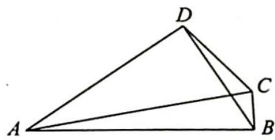

> [!faq]- 《高考数学培优40讲》例题解析
>
> > [!success]- **【答案】** A
>
> > [!note]- **【分析】**
> > 本题未单列分析。
>
> > [!note]- **【解析】**
> > 解析 如图所示, 由对角线向量定理得 $\overrightarrow{AC} \cdot \overrightarrow{BD} = \frac{(\overrightarrow{AD}^2 + \overrightarrow{BC}^2) - (\overrightarrow{AB}^2 + \overrightarrow{CD}^2)}{2} = \frac{(b^2 - a^2) + (\overrightarrow{BC}^2 - \overrightarrow{CD}^2)}{2} = \frac{(b^2 - a^2) + (\overrightarrow{AC}^2 - \overrightarrow{AB}^2) - (\overrightarrow{AC}^2 - \overrightarrow{AD}^2)}{2} = b^2 - a^2$ , 故选 A.
> > 
