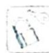
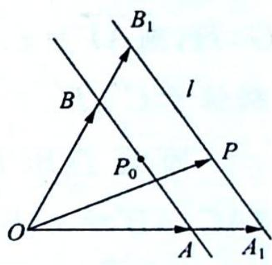
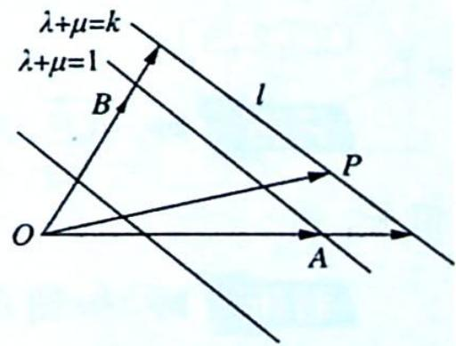

## 26.1 等和线

研究密钥

如图1所示, 设 $\{\overrightarrow{OA}, \overrightarrow{OB}\}$ 为基底, $P_{0}$ 为 AB 的中点, 则 $\overrightarrow{OA} + \overrightarrow{OB} = 2\overrightarrow{OP}_{0}, \overrightarrow{OA} - \overrightarrow{OB} = \overrightarrow{BA}.$

$\forall P \in$ 平面 $OAB, \overrightarrow{OP} = x\overrightarrow{OA} + y\overrightarrow{OB}$ .

当 $x + y = k$ (定值)， $\overrightarrow{OP} = (k - y)\overrightarrow{OA} + y\overrightarrow{OB} = k\overrightarrow{OA} + y(\overrightarrow{OB} - \overrightarrow{OA}) = k\overrightarrow{OA} + y\overrightarrow{AB}$ ，所以 $\overrightarrow{OP} - \overrightarrow{OA}_{1} = y\overrightarrow{AB}, \overrightarrow{OA}_{1} = k\overrightarrow{OA}, \overrightarrow{A_{1}P} = y\overrightarrow{AB}$ ，故 $\overrightarrow{A_{1}P} // \overrightarrow{AB}$ .

图1

特别地， $x+y=1$ ，A,P,B三点共线.

如图2所示,平面内一组基底 $\overrightarrow{OA},\overrightarrow{OB}$ 及任一向量 $\overrightarrow{OP},\overrightarrow{OP}=\lambda\overrightarrow{OA}+\mu\overrightarrow{OB}(\lambda,\mu\in\mathbb{R})$ ,若点P在直线AB上或在平行于AB的直线上,则 $\lambda+\mu=k$ (定值),反之也成立,我们把直线AB以及与直线AB平行的直线称为等和线.

等和线性质

(1) 当等和线恰为直线 $AB$ 时, $k = 1$ .

(2) 当等和线在 O 点和直线 AB 之间时, $k \in (0,1)$ .

(3) 当直线 AB 在 O 点和等和线之间时, $k \in (1, +\infty)$ .

(4) 当等和线过 O 点时, k=0.

图2

(5) 若两等和线关于 O 点对称, 则定值 k 互为相反数.

(6)定值 k 的变化与等和线到 O 点的距离成正比.

## 等和线解题步骤：

(1) 确定等和线为 1 的线.

(2)平移该线,结合动点的可行域,分析何处取得最大值和最小值.

(3)从长度比的位置角度,计算最大值和最小值.

![[高中/总复习/专题/高考数学培优40讲/高考数学培优40讲-03-三角、向量、数列、不等式与复数/第26讲_平面向量等值线模型与常见恒等式/等值线模型/26_1_等和线/例题/Q00019783.md]]
![[高中/总复习/专题/高考数学培优40讲/高考数学培优40讲-03-三角、向量、数列、不等式与复数/第26讲_平面向量等值线模型与常见恒等式/等值线模型/26_1_等和线/例题/Q00019784.md]]
![[高中/总复习/专题/高考数学培优40讲/高考数学培优40讲-03-三角、向量、数列、不等式与复数/第26讲_平面向量等值线模型与常见恒等式/等值线模型/26_1_等和线/例题/Q00019785.md]]
![[高中/总复习/专题/高考数学培优40讲/高考数学培优40讲-03-三角、向量、数列、不等式与复数/第26讲_平面向量等值线模型与常见恒等式/等值线模型/26_1_等和线/例题/Q00019786.md]]
![[高中/总复习/专题/高考数学培优40讲/高考数学培优40讲-03-三角、向量、数列、不等式与复数/第26讲_平面向量等值线模型与常见恒等式/等值线模型/26_1_等和线/例题/Q00019787.md]]
![[高中/总复习/专题/高考数学培优40讲/高考数学培优40讲-03-三角、向量、数列、不等式与复数/第26讲_平面向量等值线模型与常见恒等式/等值线模型/26_1_等和线/例题/Q00019788.md]]
![[高中/总复习/专题/高考数学培优40讲/高考数学培优40讲-03-三角、向量、数列、不等式与复数/第26讲_平面向量等值线模型与常见恒等式/等值线模型/26_1_等和线/例题/Q00019789.md]]
