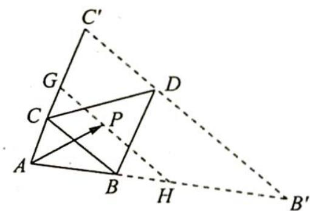

> [!faq]- 《高考数学培优40讲》例题解析
>
> > [!success]- **【答案】** C
>
> > [!note]- **【分析】**
> > 分析 ▶ 向量 $\overrightarrow{AB}, \overrightarrow{AP}, \overrightarrow{AC}$ 起点相同，过点 P 作 BC 的平行线构成一系列等和线， $\lambda + \mu$ 值的大小与起点 A 到等和线的距离成正比，过点 D 作 $B'C' \parallel BC$ ，求出此时 $\lambda + \mu$ 的值，即最大值；当点 P 位于 A 时， $\lambda + \mu = 0$ ，即最小值。由此得到 $\lambda + \mu$ 的取值范围。
>
> > [!note]- **【解析】**
> > 解析 如图所示, 过点 $P$ 作 $GH \parallel BC$ , 交 $AC, AB$ 的延长线于 $G, H$ , 则 $\overrightarrow{AP} = x\overrightarrow{AG} + y\overrightarrow{AH}$ , 且 $x + y = 1$ , 当点 $P$ 位于 $D$ 点时, $G, H$ 分别位于 $C', B'$ .
> > 
> > 因为 $\triangle BCD$ 与 $\triangle ABC$ 的面积之比为 2:1, 所以 $AC' = 3AC, AB' = 3AB.$
> > 则 $\overrightarrow{AP} = x\overrightarrow{AG} +y\overrightarrow{AH} = x\overrightarrow{AC'} +y\overrightarrow{AB'} = x\cdot 3\cdot \overrightarrow{AC} +y\cdot 3\cdot \overrightarrow{AB} = \lambda \overrightarrow{AB} +\mu \overrightarrow{AC}$ ，所以 $\lambda =$ $3y,\mu = 3x\Rightarrow \lambda +\mu = 3x + 3y = 3.$
> > 当点 $P$ 位于 $A$ 点时, 显然有 $\lambda + \mu = 0$ , 所以 $\lambda + \mu$ 的取值范围是 $[0, 3]$ ,
> >
> > 故选 **C**.
