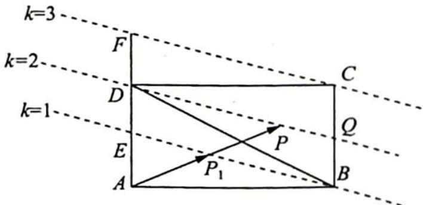

> [!faq]- 《高考数学培优40讲》例题解析
>
> > [!success]- **【答案】** B
>
> > [!note]- **【分析】**
> > 分析 ▶ $\overrightarrow{AP}, \overrightarrow{AB}, \overrightarrow{AD}$ 三个向量的起点相同. 由基底 $\{\overrightarrow{AB}, \overrightarrow{AD}\}$ 可知, $\alpha + 2\beta$ 与等和线相关.
>
> > [!note]- **【解析】**
> > 解析 如图所示, 在长方形 $ABCD$ 中, 取线段 $AD$ 的中点为 $E$ , 连接 $BE$ , 取 $BC$ 中点 $Q$ , 连接 $DQ$ , 延长 $AD$ 到 $F$ , 使得 $DF = CQ$ , 连接 $CF$ .
> > 设 $AP$ 与 $BE$ 交点为 $P_{1}, \overrightarrow{AP_{1}} = x\overrightarrow{AB} + y\overrightarrow{AE}$ , 则 $x + y = 1$ .
> > 
> > 令 $\frac{|\overrightarrow{AP}|}{|\overrightarrow{AP_1}|} = k$ ，则 $\overrightarrow{AP} = \alpha \overrightarrow{AB} + \beta \overrightarrow{AD} = \alpha \overrightarrow{AB} + 2\beta \overrightarrow{AE} = kx \overrightarrow{AB} + ky \overrightarrow{AE}$ ，所以 $\alpha + 2\beta = kx + ky = k(x + y) = k.$
> > 考虑等和线结论可知, 当点 $P$ 在 $\triangle BCD$ 内部运动时, $k \in (1,3)$ ; 当 $P$ 与 $B$ 重合时, $k=1$ , 当 $P$ 与 $C$ 重合时, $k=3$ .
> > 则 $k \in [1,3]$ ,
> >
> > 故选 **B**.
