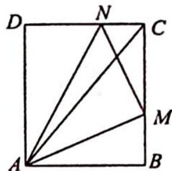
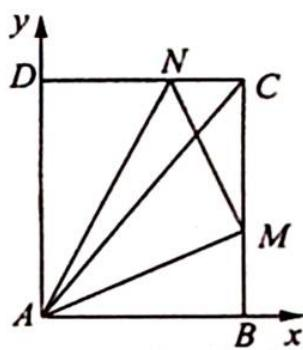
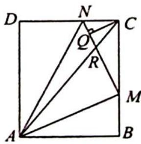

> [!faq]- 《高考数学培优40讲》例题解析
>
> > [!success]- **【答案】** 详见解析
>
> > [!note]- **【分析】**
> > 本题未单列分析。
>
> > [!note]- **【解析】**
> > 
> > 解析 ▶ 解法一:如图1所示,以A为坐标原点,AB为x轴、AD为y轴建立直角坐标系,则C(3,4),设M(3,b),N(a,4),由 $\frac{1}{CM^{2}}+\frac{1}{CN^{2}}=1$ 得 $\frac{1}{(4-b)^{2}}+\frac{1}{(3-a)^{2}}=1$ ①.
> > 
> > 由 $\overrightarrow{AC} = x\overrightarrow{AM} +y\overrightarrow{AN}$ 得 $\left\{ \begin{array}{l}3x + ay = 3\\ bx + 4y = 4 \end{array} \right.\Rightarrow \left\{ \begin{array}{l}a = \frac{3 - 3x}{y}\\ b = \frac{4 - 4y}{x} \end{array} \right.$ ，把 $a,b$ 代入式①得 $\frac{x^2}{16} +\frac{y^2}{9} =$ $(x + y - 1)^2.$
> > 图1
> > 令 $t = x + y (t > 1)$ , 则有 $9x^{2} + 16(t - x)^{2} = (t - 1)^{2} \times 16 \times 9$ , 整理得 $25x^{2} - 32tx + 16t^{2} - 144(t - 1)^{2} = 0$ , 因为 $\Delta \geqslant 0 \Rightarrow (32t)^{2} - 4 \times 25 \times [16t^{2} - 144(t - 1)^{2}] \geqslant 0$ , 整理得 $24t^{2} - 50t + 25 \geqslant 0$ , 解得 $t \geqslant \frac{5}{4}$ 或 $t \leqslant \frac{5}{6}$ (舍去), 即 $x + y$ 的最小值为 $\frac{5}{4}$ , 当且仅当 $x = \frac{4}{5}, y = \frac{9}{20}$ 时取到等号.
> > 解法二: 过点 C 作 $CQ \perp MN$ , 垂足为 Q, 如图 2 所示.
> > 因为 $\frac{1}{CM^2} + \frac{1}{CN^2} = 1$ 所表示的几何意义为在 Rt△CMN 中, 点 C 到斜边 MN 的距离为 1 , 即 $|\overrightarrow{CQ}| = 1$ .
> > 
> > 由条件 $\overrightarrow{AC} = x\overrightarrow{AM} +y\overrightarrow{AN}$ 可得 $\frac{1}{x + y}\overrightarrow{AC} = \frac{x}{x + y}\overrightarrow{AM} +\frac{y}{x + y}\overrightarrow{AN}$ ，令 $\overrightarrow{AR} =$ $\frac{1}{x + y}\overrightarrow{AC}$ ，有 $\overrightarrow{AR} = \frac{1}{x + y}\overrightarrow{AC} = \frac{x}{x + y}\overrightarrow{AM} +\frac{y}{x + y}\overrightarrow{AN}$ ，所以 $M,R,N$ 三点共线，得 $AC$ 与 $MN$ 的交点为 $R$ ，且 $|\overrightarrow{AC}| = 5.$
> > 图 2
> > 又 $|\overrightarrow{AR}| = \frac{1}{x + y} |\overrightarrow{AC}| = \frac{5}{x + y}$ , 所以要求 $x + y$ 的最小值, 等价于求 $|\overrightarrow{AR}|$ 的最大值, 即求 $|\overrightarrow{RC}|$ 的最小值, 易得 $|\overrightarrow{RC}|_{\min} = |\overrightarrow{QC}| = 1$ , 即当点 $Q, R$ 重合时, $(x + y)_{\min} = \frac{5}{4}$ .
> > ## 评注
> > 在解法二中洞察 $\frac{1}{CM^2} +\frac{1}{CN^2} = 1$ 所代表的几何意义是解决本题的关键.
