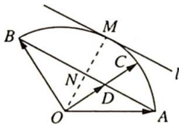

> [!faq]- 《高考数学培优40讲》例题解析
>
> > [!success]- **【答案】** 详见解析
>
> > [!note]- **【分析】**
> > 分析 ▶ 首先确定等和线为 1 的直线, 向量 $\overrightarrow{OA}$ 和 $\overrightarrow{OB}$ 为基底, 连接 $AB, AB$ 即为等和线为 1 的直线. 平移 $AB$ , 使其与 $\widehat{AB}$ 相切于一点. 此时等和线的定值 $x + y$ 最大.
> >
> > 根据定值的变化与等和线到 O 点的距离成正比求出此定值.
> >
> > 
>
> > [!note]- **【解析】**
> > 解析 如图所示, 连接 $AB$ 交 $OC$ 于 $D$ 点, 令 $\overrightarrow{OC} = \lambda \overrightarrow{OD}$ , 则 $\overrightarrow{OD} = \frac{x}{\lambda} \overrightarrow{OA} + \frac{y}{\lambda} \overrightarrow{OB}$ . 因为 $A, B, D$ 三点共线, 所以 $\frac{x}{\lambda} + \frac{y}{\lambda} = 1$ , 即 $x + y = \lambda$ . 若点 $C$ 落在直线 $AB$ 上, 则 $x + y = 1$ ; 若 $C$ 落在圆弧的切线 $l$ 上, 此时 $\frac{OM}{ON} = 2$ , 则 $x + y = 2$ . 所以 $\lambda \in [1, 2]$ , 即 $(x + y)_{\max} = 2$ .
