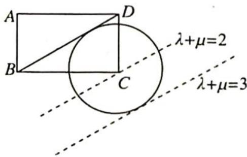
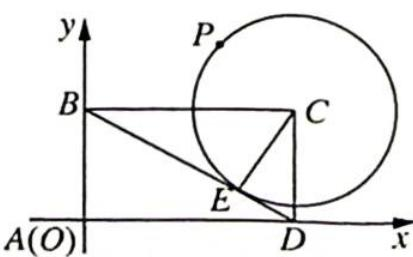

> [!faq]- 《高考数学培优40讲》例题解析
>
> > [!success]- **【答案】** A
>
> > [!note]- **【分析】**
> > 分析 ▶ 思路一: 等和线角度, 作与 $BD$ 平行且与圆 $C$ 相切的直线, 则圆上动点 $P$ 在 $BD$ 与所作切线之间的一系列等和线上. 与圆相切的等和线对应的定值即为 $\lambda + \mu$ 的最大值.
> >
> > 思路二: 目标函数角度, 求出点 P 的轨迹方程, 并用参数方程的形式表达, 将 $\lambda + \mu$ 表示为关于参数 $\theta$ 的三角函数形式, 将问题转化为求含三角函数形式的函数的最值问题, 利用三角函数有界性求解.
>
> > [!note]- **【解析】**
> > 解析 ▶ 解法一(数形结合): 如图 1 所示, 考虑向量线性分解的等和线, 可得 $\lambda + \mu$ 的最大值为 3 , 故选 A.
> > 
> > 解法二(目标函数法):根据题意作出图像,如图2所示.设BD与⊙C切于点E,连接CE.
> > 图 1
> > 以点 $A$ 为坐标原点, $AD$ 为 $x$ 轴正半轴, $AB$ 为 $y$ 轴正半轴建立直角坐标系, 则点 $C$ 坐标为 (2,1). 因为 $|CD| = 1$ , $|BC| = 2$ , 所以 $BD = \sqrt{1^2 + 2^2} = \sqrt{5}$ .
> > 又 $BD$ 切 $\odot C$ 于点 $E$ , 所以 $CE \perp BD$ , $CE$ 是 Rt $\triangle BCD$ 斜边 $BD$ 上的高. 则 $|EC| = \frac{2S_{\triangle BCD}}{|BD|} = \frac{2 \times \frac{1}{2}|BC||CD|}{|BD|} = \frac{2}{\sqrt{5}} = \frac{2\sqrt{5}}{5}$ , 即 $\odot C$ 的半径为 $\frac{2\sqrt{5}}{5}$ ,因为点 $P$ 在 $\odot C$ 上，所以点 $P$ 的轨迹方程为 $(x - 2)^{2} + (y - 1)^{2} = \frac{4}{5}$ .
> > 
> > 图 2
> > 设点 $P$ 的坐标为 $(x_0, y_0)$ ，可以设出点 $P$ 坐标满足的参数方程 $\left\{ \begin{array}{l} x_0 = 2 + \frac{2\sqrt{5}}{5}\cos \theta \\ y_0 = 1 + \frac{2\sqrt{5}}{5}\sin \theta \end{array} \right.$ ，而 $\overrightarrow{AP} = (x_0, y_0), \overrightarrow{AB} = (0, 1), \overrightarrow{AD} = (2, 0)$ .
> > 因为 $\overrightarrow{AP} = \lambda \overrightarrow{AB} +\mu \overrightarrow{AD} = \lambda (0,1) + \mu (2,0) = (2\mu ,\lambda)$ ，所以 $\mu = \frac{1}{2} x_0 = 1 + \frac{\sqrt{5}}{5}\cos \theta ,\lambda = y_0 =$ $1 + \frac{2\sqrt{5}}{5}\sin \theta .$
> > 两式相加得 $\lambda + \mu = 1 + \frac{2\sqrt{5}}{5}\sin \theta + 1 + \frac{\sqrt{5}}{5}\cos \theta = 2 + \sqrt{\left(\frac{2\sqrt{5}}{5}\right)^2 + \left(\frac{\sqrt{5}}{5}\right)^2}\sin (\theta + \varphi) = 2 + \sin (\theta + \varphi) \leqslant 3$ (其中 $\sin \varphi = \frac{\sqrt{5}}{5}, \cos \varphi = \frac{2\sqrt{5}}{5}$ ), 当且仅当 $\theta = \frac{\pi}{2} + 2k\pi - \varphi (k \in \mathbf{Z})$ 时, $\lambda + \mu$ 取得最大值为 3, 故选 A.
> > 若本题将题目改为“在平行四边形ABCD中,动点P在以点C为圆心且与BD相切的圆上.若 $\overrightarrow{AP}=\lambda\overrightarrow{AB}+\mu\overrightarrow{AD}$ ,则 $\lambda+\mu$ 的最大值为\_\_\_\_.”改过之后的题目,更深入地表现了向量基本定理、几何意义和数形结合等基本方法和思想.
