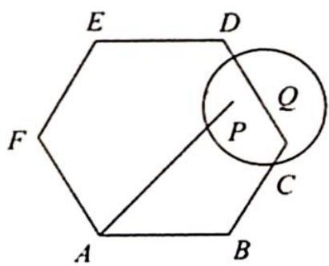
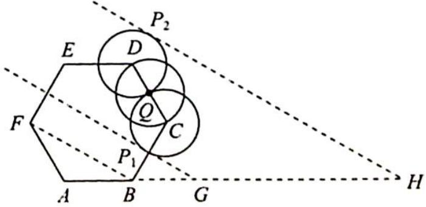

> [!faq]- 《高考数学培优40讲》例题解析
>
> > [!success]- **【答案】** 详见解析
>
> > [!note]- **【分析】**
> > 本题未单列分析。
>
> > [!note]- **【解析】**
> > 
> > 解析 如图所示, 圆心 $Q$ 在点 $C$ 处时, 设 $\overrightarrow{AP_1} = m\overrightarrow{AB} + n\overrightarrow{AF}$ , 由等和线的结论得 $m + n = \frac{AG}{AB} = \frac{2AB}{AB} = 2, 2$ 即为 $m + n$ 的最小值.
> > 同理, 圆心 $Q$ 在点 $D$ 处时, 设 $\overrightarrow{AP_2} = m\overrightarrow{AB} + n\overrightarrow{AF}$ , 由等和线的结论得 $m + n = \frac{AH}{AB} = 5, 5$ 即为 $m + n$ 的最大值.
> > 综上所述， $m+n$ 的取值范围为[2,5].
> > 
