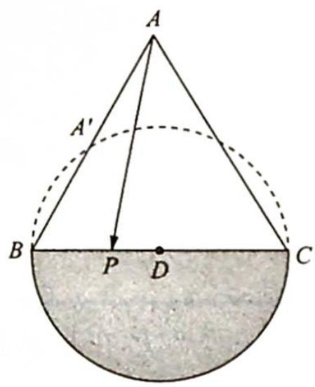
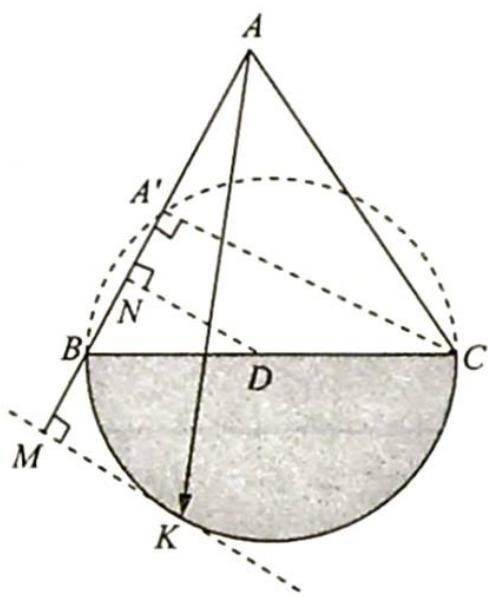

> [!faq]- 《高考数学培优40讲》例题解析
>
> > [!success]- **【答案】** 详见解析
>
> > [!note]- **【分析】**
> > 本题未单列分析。
>
> > [!note]- **【解析】**
> > 解析 因为 $\overrightarrow{AP} = x\overrightarrow{AB} + y\overrightarrow{AC}, |\overrightarrow{PD}| \leqslant 1$ 且 $x + y \geqslant 1$ , 所以点 $P$ 落在以点 $D$ 为圆心, 1为半径的圆上 (△ABC 的外侧部分, 如图 1 所示).
> > 因为 $\overrightarrow{AP} = 2x\cdot \frac{\overrightarrow{AB}}{2} +y\overrightarrow{AC} = 2x\overrightarrow{AA'} +y\overrightarrow{AC}$ ，所以当点 $P$ 在 $C$ 点时， $2x + y$ 取到最小值1.
> > 当点 $P$ 在 $K$ 点 (半圆与 $A^{\prime}C$ 平行的切线的切点, 如图 2 所示) 时, $2x + y$ 取到最大值, 由相似三角形知识可知最大值为 $\left|\frac{AM}{AA'}\right| = \frac{5}{2}$ .
> > 故 $2x + y$ 的范围为 $\left[1, \frac{5}{2}\right]$ .
> > 
> > 图1
> > 
> > 图 2
