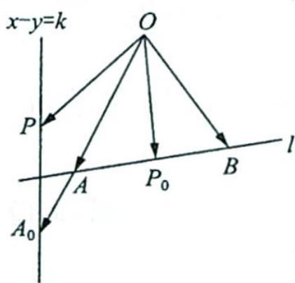
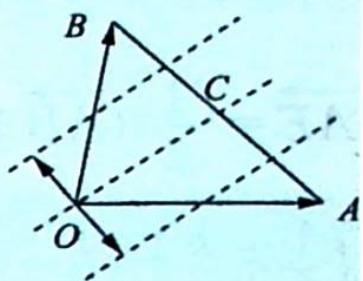
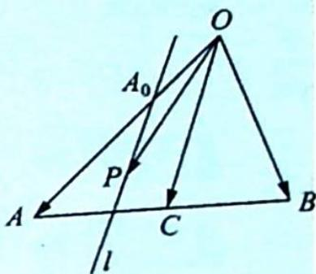

## 26.2 等差线

## 研究密钥

如图1所示, 当 $x - y = k$ (定值), $\overrightarrow{OP} = x\overrightarrow{OA} + y\overrightarrow{OB} = (k + y)\overrightarrow{OA} + y\overrightarrow{OB} = k\overrightarrow{OA} + y(\overrightarrow{OA} + \overrightarrow{OB}) = k\overrightarrow{OA} + 2y\overrightarrow{OP}_0$ .

令 $\overrightarrow{OA_0} = k\overrightarrow{OA},\overrightarrow{OP} -\overrightarrow{OA_0} = 2y\overrightarrow{OP_0}$ ，即 $\overrightarrow{A_0P} = 2y\overrightarrow{OP_0}$ ，因此 $\overrightarrow{A_0P} / / \overrightarrow{OP_0}$

$\lambda-\mu=k$ 的几何意义是 $\frac{\overrightarrow{OA_{0}}}{\overrightarrow{OA}}$ .

图1

等差线的性质

如图2所示,平面内一组基底 $\overrightarrow{OA},\overrightarrow{OB}$ 及任一向量 $\overrightarrow{OP},\overrightarrow{OP}=\lambda\overrightarrow{OA}+\mu\overrightarrow{OB}(\lambda,\mu\in\mathbb{R}),C$ 为线段 $AB$ 的中点, 若点 $P$ 在直线 $OC$ 上或在平行于 $OC$ 的直线上, 则 $\lambda - \mu = k$ (定值), 反之也成立, 我们把直线 $OC$ 以及与直线 $OC$ 平行的直线称为等差线.

(1) 当等差线恰为直线 OC 时, k=0.

(2) 当等差线过 A 点时, k=1.

(3) 当等差线在直线 OC 与点 A 之间时, $k \in (0,1)$ .

(4) 当等差线与 BA 延长线相交时, $k \in (1, +\infty)$ .

图2

(5) 若等差线关于直线 OC 对称, 则两定值 k 互为相反数.

## 等差线解题步骤：

(1)画出中线向量 $\overrightarrow{OC}=\frac{\overrightarrow{OA}+\overrightarrow{OB}}{2}$ .

(2)如图3所示,过点P作与中线向量 $\overrightarrow{OC}$ 所在直线平行的直线l交OA或其延长线于点 $A_{0}$ ，则 $\overrightarrow{OA_{0}}=k\overrightarrow{OA}$ .

图3

(3) 计算 $k$ 值, 即 $k = \lambda - \mu$ , $|k| = \frac{|\overrightarrow{OA_0}|}{|\overrightarrow{OA}|}$ , 其符号与向量 $\overrightarrow{OA_0}$ 和 $\overrightarrow{OA}$ 的方向相关, 若 $\overrightarrow{OA}$ 与 $\overrightarrow{OA_0}$ 同向, 则 $k > 0$ ; 若 $\overrightarrow{OA}$ 与 $\overrightarrow{OA_0}$ 反向, 则 $k < 0$ .

![[高中/总复习/专题/高考数学培优40讲/高考数学培优40讲-03-三角、向量、数列、不等式与复数/第26讲_平面向量等值线模型与常见恒等式/等值线模型/26_2_等差线/例题/Q00019790.md]]
![[高中/总复习/专题/高考数学培优40讲/高考数学培优40讲-03-三角、向量、数列、不等式与复数/第26讲_平面向量等值线模型与常见恒等式/等值线模型/26_2_等差线/例题/Q00019791.md]]
