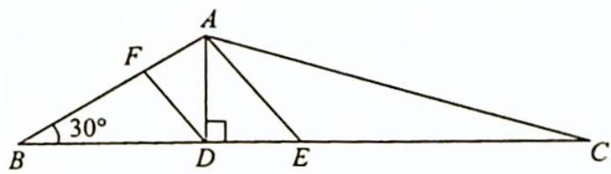

> [!faq]- 《高考数学培优40讲》例题解析
>
> > [!success]- **【答案】** B
>
> > [!note]- **【分析】**
> > 分析 ▶ 思路一: 利用等差线, 作中线向量 $\overrightarrow{AE} = \frac{1}{2} (\overrightarrow{AB} + \overrightarrow{AC})$ , 过点 $D$ 作 $DF \parallel AE$ 交 $AB$ 于点 $F$ , 设 $\lambda - \mu = k, k$ 的几何意义是 $\frac{|\overrightarrow{AF}|}{|\overrightarrow{AB}|}$ , 以下在图形中求出 $\frac{|\overrightarrow{AF}|}{|\overrightarrow{AB}|}$ 即可.
> >
> > 思路二:用基底表示向量,以 $\overrightarrow{AB},\overrightarrow{AC}$ 为基底表示为 $\overrightarrow{AD}=\lambda\overrightarrow{AB}+\mu\overrightarrow{AC}$ 的形式,再求 $\lambda-\mu$ 的值.
>
> > [!note]- **【解析】**
> > 解析 ▶ 解法一(向量的等差线)如图所示,设 AE 为 BC 边上的中线,过点 D 作 $DF \parallel AE$ 交 AB 于点 F,则由题意可得 $BD = AB \cos 30^{\circ} = \sqrt{3}$ , $BE = \frac{1}{2} BC = \frac{3\sqrt{3}}{2}$ , 所以 $DE = \frac{\sqrt{3}}{2}$ , 则 $\frac{DE}{BE} = \frac{1}{3}$ , 故此 $\frac{AF}{AB} = \frac{DE}{BE} = \frac{1}{3}$ , 且向量 $\overrightarrow{AF}, \overrightarrow{AB}$ 方向相同, 由向量等差线可知 $\lambda - \mu = \frac{AF}{AB} = \frac{1}{3}$ , 故选 B.
> > 
> > 解法二(用基底表示向量)如解法一中图所示, 设 AE 为 BC 边上的中线, 过点 D 作 DF // AE 交 AB 于点 F, 则由题意可得 $BD = AB \cos 30^{\circ} = \sqrt{3}$ , $BE = \frac{1}{2} BC = \frac{3\sqrt{3}}{2}$ , 所以 $\overrightarrow{AF} = \frac{1}{3} \overrightarrow{AB}$ , 又 $\overrightarrow{AE} = \frac{1}{2} (\overrightarrow{AB} + \overrightarrow{AC})$ , 所以 $\overrightarrow{AD} = \overrightarrow{AF} + \overrightarrow{FD} = \frac{1}{3} \overrightarrow{AB} + k \overrightarrow{AE} = \frac{1}{3} \overrightarrow{AB} + \frac{k}{2} (\overrightarrow{AB} + \overrightarrow{AC}) = \left(\frac{1}{3} + \frac{k}{2}\right) \overrightarrow{AB} + \frac{k}{2} \overrightarrow{AC}.$
> > 则 $\lambda -\mu = \left(\frac{1}{3} +\frac{k}{2}\right) - \frac{k}{2} = \frac{1}{3}$
> >
> > 故选 **B**.
