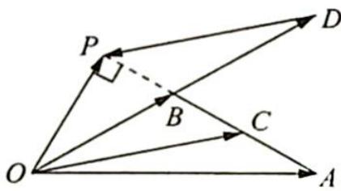
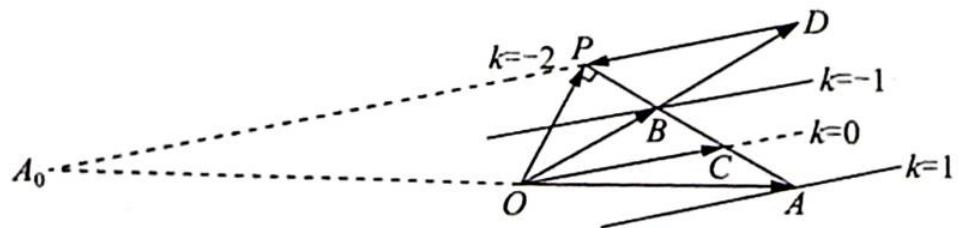

> [!faq]- 《高考数学培优40讲》例题解析
>
> > [!success]- **【答案】** 详见解析
>
> > [!note]- **【分析】**
> > 分析 由基底 $\{a,b\}$ 及 $\overrightarrow{OP}=xa+yb$ ，求x-y可考虑等差线结论.
>
> > [!note]- **【解析】**
> > 解析 ▶ 解法一: 如图 1 所示, 设点 C 为 AB 的中点, 则 $\overrightarrow{OC} = \frac{1}{2} (\overrightarrow{OA} + \overrightarrow{OB}) = \frac{1}{2} (a + b)$ , 过点 P 作 $PD \parallel OC$ 交直线 OB 于点 D, 则 $\overrightarrow{OP} = \overrightarrow{OD} + \overrightarrow{DP} = k \overrightarrow{OB} + l \overrightarrow{OC} = kb + \frac{l}{2} (a + b) = \frac{l}{2} a + \left(k + \frac{l}{2}\right)b$ , 所以 x - y = -k.
> > 
> > 图1
> > 在 $\triangle OAB$ 中,由余弦定理可得 $AB=\sqrt{OA^{2}+OB^{2}-2OA\cdot OB\cos\angle AOB}=\sqrt{3}$ ,所以 $BC=$ $AC=\frac{1}{2}AB=\frac{\sqrt{3}}{2},OB=AB$ ,所以 $\angle AOB=A=30^{\circ}$ ,又 $\angle OPA=90^{\circ}$ ,所以 $\angle AOP=60^{\circ}$ , $\angle BOP=\angle AOP-\angle AOB=30^{\circ}$ ,即 $BP=\frac{1}{2}OB=\frac{\sqrt{3}}{2}$ ,则 $BP=BC,OB=BD,\overrightarrow{OD}=2\overrightarrow{OB},$ $k=2$ ,故 $x-y=-k=-2$ .
> > 解法二:如图2所示,取AB中点C,连接 $\overrightarrow{OC}$ ,过O作 $OP \perp AB$ 交AB的延长线于点P,过P作 $PD \parallel OC$ ,延长DP与OA的反向延长线相交于点 $A_{0}$ .在 $\triangle OAB$ 中,因为 $|a|=3$ , $|b|$ = $\sqrt{3}$ ,且 $\angle AOB=30^{\circ}$ ,易知 $|\overrightarrow{AB}|^{2}=|\overrightarrow{OB}-\overrightarrow{OA}|^{2}=|b-a|^{2}=b^{2}-2ab+a^{2}=3-2\times3\times\sqrt{3}\times\cos30^{\circ}+9=3$ ,所以 $|\overrightarrow{AB}|=\sqrt{3}=|\overrightarrow{OB}|$ ,则 $A=30^{\circ}$ .
> > 在 Rt△OAP 中，∠AOP=60°，|OP|=3/2，|AP|=3√3/2，所以 B 为 PC 中点.
> > 令 $x - y = k$ ，由等差线结论知 $|k| = \frac{|OA_0|}{|OA|} = \frac{|PC|}{|CA|} = 2$ ，又因为 $\overrightarrow{OA_0}$ 与 $\overrightarrow{OA}$ 反向，所以 $P$ 点对应的 $k = -2$ ，即 $x - y = -2$
> > 
> > 图 2
