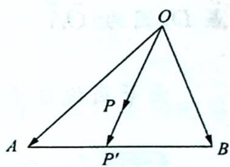
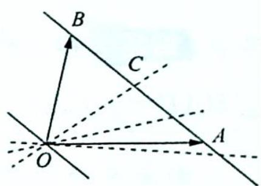
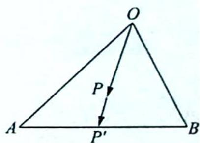

## 26.3 等商线

研究密钥

如图1所示, $\overrightarrow{OP} = x\overrightarrow{OA} +y\overrightarrow{OB},\overrightarrow{OP'}\parallel \overrightarrow{OP}$ ，不妨设 $\overrightarrow{AP'} = \lambda \overrightarrow{P'B}$ ，可得 $\overrightarrow{OP'} - \overrightarrow{OA} =$ $\lambda (\overrightarrow{OB} -\overrightarrow{OP'})$ ，即 $(\lambda +1)\overrightarrow{OP'} = \lambda \overrightarrow{OB} +\overrightarrow{OA}$ ，得 $\overrightarrow{OP'} = \frac{1}{\lambda + 1}\overrightarrow{OA} +\frac{\lambda}{\lambda + 1}\overrightarrow{OB}$ ，所以 $\frac{x}{y} = \frac{1}{\lambda} = \frac{\overrightarrow{P'B}}{\overrightarrow{AP'}}$

平面内一组基底 $\overrightarrow{OA},\overrightarrow{OB}$ 及任一向量 $\overrightarrow{OP},\overrightarrow{OP}=\lambda\overrightarrow{OA}+\mu\overrightarrow{OB}(\lambda,\mu\in$ R), 若点 P 在过 O 点(不与 OA 重合)的直线上, 则 $\frac{\lambda}{\mu}=k$ (定值), 反之也成立, 我们把过 O 点的直线(除 OA 外)称为等商线, 如图 2 所示.

等商线结论：

图1

(1) 当等商线过 AB 中点 C 时, k=1.

(2) 当等商线与线段 AC (除端点) 相交时, $k \in (1, +\infty)$ .

(3) 当等商线与线段 $BC$ (除端点) 相交时, $k \in (0,1)$ .

(4) 当等商线为 OB 时, k=0.

(5) 当等商线与线段 BA 延长线相交时, $k \in (-\infty, -1)$ .

(6) 当等商线与线段 $AB$ 延长线相交时, $k \in (-1,0)$ .

图 2

(7) 当等商线与直线 AB 平行时, k = -1.

等商线解题步骤：

(1)如图3所示,找到三点共线的情形,如 $\overrightarrow{OP}=x\overrightarrow{OA}+y\overrightarrow{OB}$ ,延长OP交AB或其延长线(反向延长线)于点 $P'$ ,则 $A,P',B$ 三点共线.

(2) 计算 $\frac{\overrightarrow{P'B}}{\overrightarrow{AP'}}$ ，则 $\frac{x}{y} = \frac{\overrightarrow{P'B}}{\overrightarrow{AP'}}$ .

图3

![[高中/总复习/专题/高考数学培优40讲/高考数学培优40讲-03-三角、向量、数列、不等式与复数/第26讲_平面向量等值线模型与常见恒等式/等值线模型/26_3_等商线/例题/Q00019792.md]]
![[高中/总复习/专题/高考数学培优40讲/高考数学培优40讲-03-三角、向量、数列、不等式与复数/第26讲_平面向量等值线模型与常见恒等式/等值线模型/26_3_等商线/例题/Q00019793.md]]
![[高中/总复习/专题/高考数学培优40讲/高考数学培优40讲-03-三角、向量、数列、不等式与复数/第26讲_平面向量等值线模型与常见恒等式/等值线模型/26_3_等商线/例题/Q00019794.md]]
