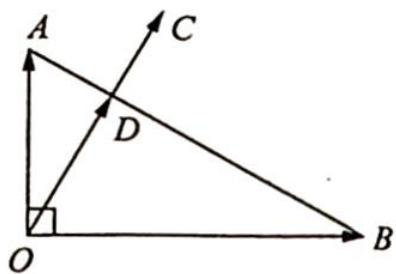

> [!faq]- 《高考数学培优40讲》例题解析
>
> > [!success]- **【答案】** 详见解析
>
> > [!note]- **【分析】**
> > 分析 ▶ 思路一: 由 $\overrightarrow{OC} = m\overrightarrow{OA} + n\overrightarrow{OB}$ , 求 $\frac{m}{n}$ 的值, 故考虑用等商线结论求解. 设直线 $OC$ 与直线 $AB$ 交于点 $D$ , 则 $\frac{m}{n} = \frac{\overrightarrow{BD}}{\overrightarrow{DA}}$ , 在图中求 $BD, DA$ 即可.
> >
> > 思路二:考虑用基底表示向量,以 $\overrightarrow{OA},\overrightarrow{OB}$ 为基底表示 $\overrightarrow{OC}=m\overrightarrow{OA}+n\overrightarrow{OB}$ 的形式,再求 $\frac{m}{n}$ 的值.
>
> > [!note]- **【解析】**
> > 解析 ▶ 解法一(基底表示):如图所示,设直线 OC 与直线 AB 交于点 D,则根据题意易求得 $AD=\frac{1}{2}$ , AB=2,所以 $\overrightarrow{AD}=\frac{1}{4}\overrightarrow{AB}$ , $\overrightarrow{OD}=\overrightarrow{OA}+\overrightarrow{AD}=$ $\overrightarrow{OA}+\frac{1}{4}\overrightarrow{AB}=\overrightarrow{OA}+\frac{1}{4}(\overrightarrow{OB}-\overrightarrow{OA})=\frac{3}{4}\overrightarrow{OA}+\frac{1}{4}\overrightarrow{OB}$ , 则 $\overrightarrow{OC}=k\overrightarrow{OD}=$ $k\left(\frac{3}{4}\overrightarrow{OA}+\frac{1}{4}\overrightarrow{OB}\right)=\frac{3k}{4}\overrightarrow{OA}+\frac{k}{4}\overrightarrow{OB}$ , 故 $\frac{m}{n}=\frac{3k}{4}\div\frac{k}{4}=3$ .
> > 
> > 解法二(利用等商线结论):如解法一中的图所示,在 $\angle AOB$ 内,设射线 $OC$ 与线段 $AB$ 交于点 $D$ ,因为 $|\overrightarrow{OA}|=1$ , $|\overrightarrow{OB}|=\sqrt{3}$ , $\overrightarrow{OA} \cdot \overrightarrow{OB}=0$ ,所以 $|AB|=2$ ,又 $\angle AOC=30^{\circ}$ ,所以 $|AD|=\frac{1}{2}$ .
> > 由等商线结论可知 $\frac{m}{n}=\frac{|\overrightarrow{BD}|}{|\overrightarrow{DA}|}=3$ .
