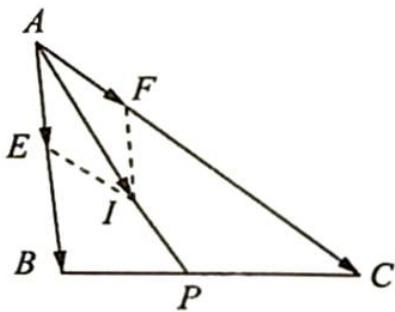

> [!faq]- 《高考数学培优40讲》例题解析
>
> > [!success]- **【答案】** 详见解析
>
> > [!note]- **【分析】**
> > 本题未单列分析。
>
> > [!note]- **【解析】**
> > 解析 如图所示, 延长 $AI$ 交 $BC$ 于点 $P$ , 因为 $I$ 是 $\triangle ABC$ 的内心, 故 $\angle BAP = \angle CAP$ .
> > 由角平分线的性质知 $\frac{PC}{PB} = \frac{AC}{AB} = \frac{3}{2}$ . 又 $\overrightarrow{AI} = p\overrightarrow{AB} + q\overrightarrow{AC}$ , 所以 $\overrightarrow{AP} = k\overrightarrow{AI} = kp\overrightarrow{AB} + kq\overrightarrow{AC}$ .
> > 由等商线结论可知 $\frac{k p}{k q} = \frac{p}{q} = \frac{|\overrightarrow{C P}|}{|\overrightarrow{P B}|} = \frac{3}{2}$ .
> > 
