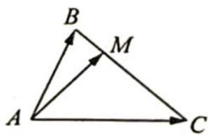

> [!faq]- 《高考数学培优40讲》例题解析
>
> > [!success]- **【答案】** B
>
> > [!note]- **【分析】**
> > 分析 由 $\overrightarrow{AM}=\lambda\overrightarrow{AB}+\mu\overrightarrow{AC}$ ，求 $\frac{\lambda}{\mu}$ 的值，故考虑等商线结论.
>
> > [!note]- **【解析】**
> > 解析 如图所示,由等商线结论知 $\frac{\lambda}{\mu} = \frac{|\overrightarrow{CM}|}{|\overrightarrow{MB}|}$ , 故求出 $CM$ 及 $MB$ 的长度即可.
> > 
> > 在 $\triangle ABC$ 中,因为 $AB=2,AC=3,\angle BAC=\frac{\pi}{3}$ ,所以 $BC=\sqrt{4+9-2\times2\times3\cos\frac{\pi}{3}}=\sqrt{7}$ .
> > 
> > 由等积法知 $S_{\triangle ABC} = \frac{1}{2}\times 2\times 3\sin \frac{\pi}{3} = \frac{1}{2}\times \sqrt{7}\times AM$ ，易知 $AM = \frac{3\sqrt{3}}{\sqrt{7}}.$
> > 在 Rt△ACM 及 Rt△ABM 中, 易知 $CM = \frac{6\sqrt{7}}{7}, BM = \frac{\sqrt{7}}{7}$ , 所以 $\frac{\lambda}{\mu} = \frac{|\overrightarrow{CM}|}{|\overrightarrow{MB}|} = 6$ ,
> >
> > 故选 **B**.
