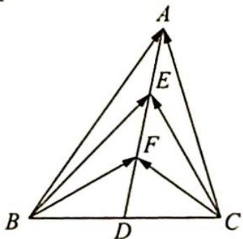

<!-- question-source:start -->
6. 如图所示, 在 $\triangle ABC$ 中, $D$ 是 $BC$ 的中点, $E, F$ 是 $AD$ 上两个三等分点, $\overrightarrow{BA} \cdot \overrightarrow{CA} = 4$ , $\overrightarrow{BF} \cdot \overrightarrow{CF} = -1$ , 则 $\overrightarrow{BE} \cdot \overrightarrow{CE}$ 的值是 \_\_\_\_.

<!-- question-source:end -->

![[Q00019818A1]]
