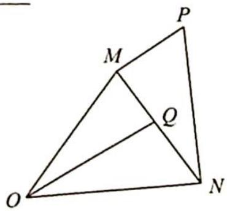

<!-- question-source:start -->
7. 如图所示, 已知 ${OM} = {ON} = 1,\overrightarrow{OP} = x\overrightarrow{OM} + y\overrightarrow{ON}\left( {x,y \in  \mathbf{R}}\right)$ ,若 $\bigtriangleup  {PMN}$ 为以 $M$ 为直角顶点的直角三角形,则 $x - y$ 的值为

<!-- question-source:end -->

![[Q00019819A1]]
