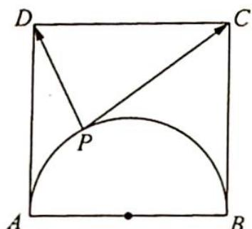

<!-- question-source:start -->
9. 设正方形 ABCD 的边长为 4, 动点 P 在以 AB 为直径的圆弧 $\overrightarrow{PAB}$ 上 (如图所示), 则 $\overrightarrow{PD} \cdot \overrightarrow{PC}$ 的取值范围是 \_\_\_\_.

<!-- question-source:end -->

![[Q00019821A1]]
