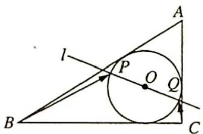

<!-- question-source:start -->
12. 如图所示, 圆 $O$ 为 Rt $\triangle ABC$ 的内切圆, 已知 $AC=3, BC=4, \angle C=90^{\circ}$ , 过圆心 $O$ 的直线 $l$ 交圆 $O$ 于 $P, Q$ 两点, 则 $\overrightarrow{BP} \cdot \overrightarrow{CQ}$ 的取值范围是 \_\_\_\_.

<!-- question-source:end -->

![[Q00019824A1]]
