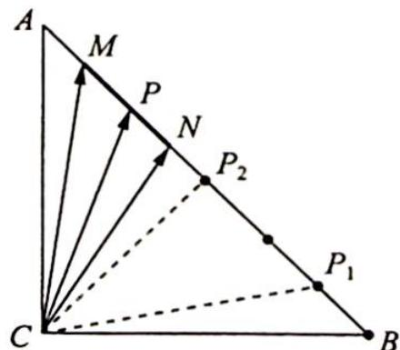

> [!faq]- 《高考数学培优40讲》参考答案
>
> > [!success]- **【答案】** D
>
> > [!note]- **【分析】**
> > 本题未单列分析。
>
> > [!note]- **【解析】**
> > 解法一(极化恒等式): 如图所示, 取 $MN$ 的中点为 $P$ , 由极化恒等式得 $\overrightarrow{CM} \cdot \overrightarrow{CN} = |\overrightarrow{CP}|^{2} - \frac{1}{4} |\overrightarrow{MN}|^{2} = |\overrightarrow{CP}|^{2} - \frac{1}{2}$ .
> > 当 $M$ 或 $N$ 点运动到 $AB$ 中间时, 即 $P$ 为线段的 $AB$ 中点时, $\left|\overrightarrow{CP}\right|_{\min} = \left|\overrightarrow{CP_2}\right| = \frac{3}{\sqrt{2}} = \frac{3\sqrt{2}}{2}$ ; 当 $M$ 或 $N$ 点运动到 $A$ 或 $B$ 时, $\left|\overrightarrow{CP}\right|_{\max} = \left|\overrightarrow{CP_1}\right| = \sqrt{CP_2^2 + P_1P_2^2} = \frac{\sqrt{26}}{2}$ , 即 $\left|\overrightarrow{CP}\right| \in \left[\frac{3\sqrt{2}}{2}, \frac{\sqrt{26}}{2}\right]$ , 从而 $\overrightarrow{CM} \cdot \overrightarrow{CN} = \left|\overrightarrow{CP}\right|^2 - \frac{1}{2} \in [4,6]$ , 故选 D.
> > 
> > 解法二(坐标法): 以 C 为原点, CB, CA 所在直线为 x 轴, y 轴, 建立平面直角坐标系. 设 M 在 N 的左侧, $M(x, y)$ , 则 $x + y = 3$ , 即 y = 3 - x, $M(x, 3 - x)$ .
> > 又 $MN = \sqrt{2}$ , 所以点 $N(x + 1, 3 - x - 1)$ , 即 $N(x + 1, 2 - x), x \in [0, 2]$ , 于是 $\overrightarrow{CM} \cdot \overrightarrow{CN} = x(x + 1) +$
> > $\dot{m}=-1$
> > $(3 - x)(2 - x) = 2x^{2} - 4x + 6 = 2(x - 1)^{2} + 4(0 \leqslant x \leqslant 2)$ , 所以当 $x = 1$ 时, $\overrightarrow{CM} \cdot \overrightarrow{CN}$ 取最小值 4; 当 $x = 0$ 或 $x = 2$ 时, $\overrightarrow{CM} \cdot \overrightarrow{CN}$ 取最大值 6, 因此 $\overrightarrow{CM} \cdot \overrightarrow{CN}$ 的取值范围为 [4,6],
> >
> > 故选 **D**.
